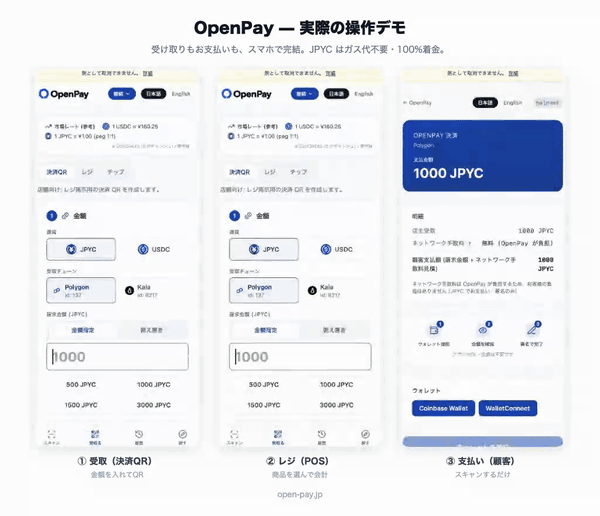

# OpenPay

OpenPay is a **non-custodial QR payment tool** that turns JPYC / USDC wallet transfers into a simple checkout for stores, events, creators, and AI agents.

OpenPay は、JPYC / USDC のウォレット送金を、店舗・イベント向け QR 決済体験に変えるノンカストディ型 OSS 決済ツールです。

**Demo**: <https://open-pay.jp> · **Status**: Beta · **License**: MIT


**Live demo (mobile) — receive / register / pay · 実際の操作（受取・レジ・支払い）**



---

## Key features

- **Non-custodial** — payments go directly to the merchant wallet; OpenPay never holds funds.
- **No wallet lock-in** — any wallet that signs standard ERC20 / ERC-4337 / EIP-7702 transactions can pay; no app install required.
- **JPYC / USDC** support (Japan's electronic payment instrument + Circle's USD stablecoin).
- **QR-locked conditions** — amount, token, chain, and recipient are pinned per QR; customers cannot mistype them.
- **Two payment modes** — Standard (customer pays gas in the native token) or Gasless (customer pays with just the token; for JPYC OpenPay sponsors the gas and charges a small per-transaction usage fee — **works in any wallet**, for USDC gas is paid in USDC via the paymaster **but only for EIP-7702 smart-account wallets — ordinary wallets fall back to standard**).
- **Portal UX** — a single app with separate surfaces for paying (`/scan`), receiving (`/create`), browsing history (`/history`), and discovering on-chain services (`/explore`), all behind a shared header / bottom-nav and wallet-state badge.
- **Block explorer link** on every receipt — merchants verify on-chain truth, not just a UI screen.
- **Local transaction history** — per-browser LocalStorage history at `/history`, with filters (period / status / search), a JPY-converted GMV summary, CSV export, and a "latest 3" strip on the QR builder.
- **Accounting integration** — `/history` exports income CSV in **freee**, **Money Forward**, and **Yayoi** formats (Yayoi-native in Shift_JIS), and — opt-in via `NEXT_PUBLIC_ENABLE_FREEE_SYNC` — connects to **freee over OAuth** to push income transactions in one click. Gated behind **SIWE wallet login** (no password/account) with an idempotent "sync to freee" batch (re-clicking never double-books).
- **Sales line items & simple register** — the QR builder has an optional **accounting fields** section (product/purpose name, memo, tax rate & category, receipt no.), and `/create` adds a mobile-friendly **simple register**: add **multiple products to a cart** (from presets or typed), set per-line quantity / unit price / tax rate, and generate an itemized `/checkout` QR for the cart total. The line items travel with the payment and are recorded in `/history` as a **sales detail** (per-line product, quantity, unit price, tax rate, in-tax amount, total, receipt no.). They flow into the accounting CSVs (tax category + an item summary like “Coffee x2 / T-shirt x1” in the description), a dedicated **line-item CSV** (one row per product), and freee’s memo (one deal per transaction, items summarised — idempotent, never double-booked). One cart is a single currency. Register mode and product presets are stored locally (LocalStorage; no server DB). These are **bookkeeping aids for CSV import** — OpenPay is not a POS or accounting product, and final accounting (tax treatment, mixed-rate carts, etc.) should be confirmed in your accounting software / by a tax advisor. JPYC is treated as ¥1; tax is computed in the token’s own units (no forced JPY conversion for USDC).
- **Mobile order & `@handle` storefronts** *(live in production)* — a store can publish a menu at `open-pay.jp/@handle` (or share a `/order` link); customers browse, add to a cart, and pay by QR, with the receiving wallet shared with the profile/tip page. Flag-gated layers add order relay to the merchant, kitchen / hall fulfillment boards (overdue orders tint amber/red, the kitchen aggregates uncooked item totals and can sort by pickup time), live sold-out toggles, open-from / last-order auto-stop and pre-order time slots, a pickup-ready customer notification, an optional customer **order memo** (allergies / requests), and a **dine-in staff-call button** bound to the customer's own paid order (see the env table).
- **Payment push notifications** *(live in production)* — merchants get a Web Push when a payment (or mobile order) lands: SIWE-bound per-device subscriptions, server-authoritative triggers only (the relay/order paths — never client-reported logs), 60-second coalescing ("n new payments"), amount shown only per-device **opt-in**, a **"send test notification"** button, and notification tap lands on `/history` with the newest payment highlighted. On iOS, push requires the home-screen (A2HS) PWA — the panel guides users there.
- **Installable PWA + offline receive QR** *(live in production)* — installable web app (manifest screenshots, add-to-home-screen hints at peak moments), a "today's sales" card on `/` for connected merchants, and an **offline mode for the receive screen**: once `/create` has been opened online, the page and the **last generated QR** keep working with no signal (QR is generated on-device) — for stalls, events, and basements. Payment routes are never served from cache.
- **Printable store kit** — `/kit` prints an A4 sheet of four A6 "Cash & OpenPay accepted" counter POPs plus a door sticker; with the customer-facing payment-QR poster (token / chain logos + 3-step how-to) from `/create`, a store can be fully signposted with two sheets of paper.
- **Reference market rate** — a lightweight strip on `/` and `/create` shows `1 USDC = ¥X.XX` via a 5-min server-cached CoinGecko proxy; `1 JPYC = ¥1.00 (peg)` is fixed.
- **Creator digital goods store** *(live in production)* — creators sell digital items on their `@handle` profile for JPYC: **URL products** (share links to PDFs / ZIPs / videos on free hosting) and **text products** (prompts, templates, up to 20k chars, stored by OpenPay for delivery). No seller fee — the buyer pays price + the x402 facilitator fee (1%, min 1 JPYC); sales settle **directly to the seller wallet** (non-custodial). Ships with a Specified-Commercial-Transactions-compliant purchase confirmation, seller-info registration, a **permanent purchase library** (re-download anytime, per-revision), purchase-provenance display (wallet / purchase ID / tx shown with the content as a resale deterrent), product images + gallery (up to 4), and **per-product share links** whose OG cards open the purchase dialog directly (`/@handle?product=…`). See `/guide/store` for a hands-on selling guide.
- **x402 / AI-agent payments** *(live in production)* — a managed **JPYC x402 facilitator** with a public **AI store** (`/discovery`: searchable catalog + self-service seller registration), first-party demo resources, and the `openpay-x402-mcp` MCP package (two profiles: keyless human-pays ordering, and guarded autonomous x402 payments). Most x402 servers are USDC-only; OpenPay adds **JPYC**.
- **OSS, self-hostable** under MIT.

## Why OpenPay?

Wallet-to-wallet transfers work, but a customer-typed transfer at a checkout counter is error-prone — the wrong token, wrong chain, or off-by-one amount sends money that can't be recovered.

OpenPay generates a **QR with the amount, token, chain, and recipient fixed by the merchant**. The customer scans, reviews, signs — and funds land in the merchant's wallet directly. No new account to create, no merchant onboarding, no balance held by OpenPay.

## Payment modes

| Mode | Gas | Best for |
|---|---|---|
| **Standard payment (with gas)** | Customer pays in their own wallet (POL / ETH) | Web3 users who already hold native gas |
| **Gasless payment** | For JPYC, OpenPay sponsors the gas and charges a per-transaction OpenPay usage fee (see Fees) — works in any wallet. For USDC, the customer pays gas in USDC via the Pimlico / Circle paymaster (OpenPay collects 0) — **requires an EIP-7702 smart-account wallet; ordinary wallets fall back to standard** | JPYC: any wallet. USDC: customers whose wallet is an EIP-7702 smart account |

- Gasless for **JPYC** uses OpenPay's self-hosted **EIP-3009 relayer**: the customer signs a `receiveWithAuthorization` to a forwarder (or, where no forwarder is configured, a plain `transferWithAuthorization` directly to the merchant — a plain EIP-712 signature, **no EIP-7702 delegation required**, so it works in MetaMask and other injected wallets), and the relayer submits it on-chain. In the **recover** configuration (forwarder set), OpenPay sponsors the gas (POL / KAIA / AVAX) and a per-transaction **OpenPay usage fee** is split to the OpenPay fee-receiver atomically in the same transaction (see Fees); for payments the **merchant always absorbs the fee** (the customer pays the displayed price) — the per-QR gas-bearer toggle is removed for JPYC recover. Live on **Polygon, Kaia, and Avalanche C-Chain** mainnet. Pimlico / EIP-7702 sponsorship remains as an automatic fallback on Polygon / Kaia (on Avalanche, whose EIP-7702 is non-canonical, the fallback is standard mode). If the relay's HTTP response is lost mid-flight, the client **latches the signed payload** (no re-signing, no silent fallback to standard mode) and auto-resolves the outcome via a read-only status endpoint — a settled payment completes normally (receipt, order relay, history), and **double payment is structurally prevented**.
- Gasless for **USDC** uses ERC-4337 + ERC-7702. Gas is sponsored via **Pimlico** (ERC20 paymaster) or, for USDC on Base / Arbitrum / Optimism, **Circle Paymaster v0.8** (gas paid directly in USDC; OpenPay collects 0 fee). ⚠️ **USDC gasless requires the customer's EOA to already be EIP-7702-delegated to a smart account** — an ordinary, never-delegated injected wallet cannot bootstrap the delegation (viem cannot sign the 7702 authorization over JSON-RPC), and MetaMask's own Stateless7702 smart account is currently disabled pending a viem / delegation-toolkit fix; both **fall back to standard payment** (the customer pays their own gas). It also requires a chain whose EIP-7702 is active (see the Avalanche note below). **JPYC gasless has no such requirement** — it is a signature-only EIP-3009 relay that works in any injected wallet.
- Standard mode is a plain ERC20 `transfer` (single transfer to the merchant).
- The gasless network-fee bearer can be set with `gas=customer` (default) or `gas=merchant`. For **JPYC gasless in recover mode** it decides who bears the per-transaction OpenPay usage fee: `customer` adds it on top of the payment, `merchant` absorbs it from the amount received. For the **USDC** paymaster paths it has no effect on what OpenPay collects (OpenPay collects 0).

## Fees

In **gasless** mode for **JPYC** (recover configuration), each payment carries a **per-transaction OpenPay usage fee** — **1% of the payment with a 2 JPYC minimum** (`max(2 JPYC, 1%)`). The fee is deducted at settlement and split to the OpenPay fee-receiver atomically in the same transaction. The fee-bearer is **fixed, not a per-QR choice**: for **payments** (`/pay`, `/checkout`, the register) the **merchant always absorbs the fee** and the **customer pays exactly the displayed price** (the merchant's net = price − fee). OpenPay never takes custody: the principal price of goods still moves customer→merchant directly on-chain, and only the usage-fee portion is split out.

For **tips** (`/tip`, `@handle` tip pages) the **tipper pays a flat gas-equivalent floor (about 2 JPYC)** on top of the tip — the **1% does not apply to tips** (tips stay at the flat floor).

There are **no fees** on receiving a payment itself, on **standard** (with-gas) mode (the customer pays their own gas, OpenPay does not touch it), or on the **USDC** paths (gas is paid by the customer directly in USDC via the Pimlico / Circle paymaster; OpenPay collects 0). The usage fee applies only to JPYC gasless (recover) payments and tips.

**Mobile-order system fee (flag-gated; live in production).** When `NEXT_PUBLIC_ENABLE_MOBILE_ORDER_FEE` is on (production sets `1`; code default off), payments made through a mobile-order storefront (`@handle` / `/order`) carry the OpenPay usage fee at a **mobile-order rate** (the **mobile-order system fee**) — consideration for the mobile-order *system* (shop page, menu, order management, order relay). It is **not charged in addition to** the gasless per-tx usage fee: on a mobile order only this rate applies, and the gas OpenPay sponsors is included in it (no separate gasless fee on top). It is **path-independent**: it applies whether the payment goes through the gasless relay **or** standard (with-gas) mode, so a gasless-by-other-means or standard payment does not escape it. The rate is **1%** for in-store / kiosk (`storefront`) and **3%** for pre-order mobile ordering (`preorder`) — a flat percent (no floor). For pre-order a per-store toggle picks **store-borne** (deducted from the merchant's receipt; customer sees the price only) or **customer-added** (the customer pays price + 3%). On the relay path it is enforced server-side — the relay route recomputes the rate from a code constant keyed by the order kind, so the client cannot lower it — and split to the same fee-receiver in the same transaction. It is booked as a **system fee** (not a network/gas cost) in history / CSV. `/pay`, tips, and ordinary checkout links are unaffected. Rates live in `lib/mobileOrderFee.ts`, fenced against the disclosed numbers in `lib/legal.ts` (`DISCLOSED_MOBILE_ORDER_FEE`).

**Digital goods store (live in production).** Selling digital items on `@handle` profiles carries **no seller fee**; the buyer pays the listed price plus the **x402 facilitator fee** (1% of price, min 1 JPYC) added on the buyer side — the same fee schedule as other x402 payments, applied because store purchases settle over the x402 rail. Disclosed in Terms Article 13 and the Tokutei notice.

**Register (POS) path-independence (flag-gated; live in production).** The existing OpenPay usage fee is, historically, gas-recovery-framed and so only fires on the gasless **relay** path; a register sale paid via the **standard** (with-gas) path escaped it. When `NEXT_PUBLIC_ENABLE_REGISTER_FEE` is on (production sets `1`; code default off), JPYC payments checked out via the **register** (`RegisterMode` → `/checkout`) also carry the usage fee on the **standard** path — `billWei × NEXT_PUBLIC_RECOVER_FEE_BPS / 10000` (no gas floor, store-borne, split as a separate transfer), reframed as consideration for use of the service (the register), not gas sponsorship. The rate follows the recover schedule (`NEXT_PUBLIC_RECOVER_FEE_BPS`, **now 1%**), so with the flag on it charges the current recover rate. The relay path is unchanged (recover already charges it). USDC, payment QR (`/pay`), tips, and manually created checkout links are out of scope.

This pricing is **not a percentage skim of arbitrary size**: it is a small, capped, per-transaction service fee for the gas-sponsored JPYC relay. OpenPay remains a non-custodial software / infrastructure provider rather than a payment intermediary under the Japanese Payment Services Act framework.

## Supported tokens and chains

| Token | Merchant receiving chains | Buyer-pay-from chains (cross-chain ON) | Notes |
|---|---|---|---|
| **JPYC** (v3, Japan's electronic payment instrument under the revised Payment Services Act) | Polygon, Kaia, Avalanche C-Chain | same (no cross-chain) | Gasless via OpenPay's self-hosted **EIP-3009 relayer** (signature-based, no EIP-7702 needed) — live on Polygon, Kaia, and Avalanche; Pimlico / 7702 sponsorship as fallback on Polygon / Kaia. On **Avalanche** gasless is **recover-mode only** (a forwarder is required; ~2 JPYC gas floor, same as Polygon / Kaia). **Ethereum L1** JPYC receiving is also supported but **standard-mode only** — the customer pays ETH gas (L1 gas is too volatile for a sponsored relay, so there is no gasless path) — gated behind a default-off flag (`NEXT_PUBLIC_ENABLE_JPYC_ETHEREUM`, mainnet only). |
| **USDC** (Circle native — bridged USDC.e is **not** supported) | Base, Arbitrum, Optimism, Polygon, **Ethereum L1**, **Avalanche C-Chain** (6) | merchant 6 + **Unichain, World Chain, Sonic, Sei, HyperEVM** (11 total, via Circle Gateway / CCTP V2) | Gasless via Pimlico ERC20 Paymaster on Base / Arbitrum / Optimism / Polygon / Ethereum L1; **Circle Paymaster v0.8** runs in parallel for USDC on Base / Arbitrum / Optimism (USDC-native gas, OpenPay 0 fee). **USDC gasless additionally requires the buyer's EOA to be an EIP-7702 smart account (already delegated); ordinary / undelegated wallets fall back to standard payment** (JPYC gasless has no such requirement). **Avalanche C-Chain is standard-mode only for now** — its EIP-7702 (ACP-209) is not yet activated on mainnet, so gasless (which relies on 7702) gracefully falls back to standard payment; it re-enables automatically once ACP-209 ships. The 5 buyer-only chains are cross-chain **sources only** (they do not appear in the merchant chain chooser). Cross-chain payments require the buyer to hold native gas (ETH/POL) on the source chain — see the cross-chain notes below. |

`NEXT_PUBLIC_NETWORK_ENV=testnet` swaps mainnets for Base / Arbitrum / Optimism Sepolia + Polygon Amoy + Kairos Testnet + Sepolia + Avalanche Fuji + Unichain Sepolia + World Chain Sepolia + Sonic Blaze Testnet + Sei Testnet + HyperEVM Testnet.

> **USDC balances are chain-specific.** The same wallet address can receive USDC on all six merchant chains, but each chain holds a separate balance. Optional chain-abstraction via Circle Gateway / CCTP V2 is available as an augmentation when the buyer's USDC is on a different chain than the merchant's selected chain (see [docs/DEPLOY_CHECKLIST.md §10](./docs/DEPLOY_CHECKLIST.md) for status and operator verification).

> **Cross-chain reach:** When the merchant enables cross-chain in the QR (default ON for USDC), customers can pay from any of **11 chains** — the 6 receiving chains plus Unichain, World Chain, Sonic, Sei, and HyperEVM. The print poster lists all 11 so customers know up-front which wallet works. Circle Gateway / CCTP V2 forwards the value to the merchant's selected receiving chain (~5–30 seconds end-to-end depending on path).

> **Cross-chain is "gas-on" for the buyer.** Same-chain payments are gasless (the buyer pays gas in USDC via the paymaster). A cross-chain payment bridges from the buyer's wallet via their own EOA, so the buyer needs the **source chain's native gas (ETH/POL etc.)** — it cannot be completed with USDC alone.

> **Ethereum L1 caveat:** USDC payments on Ethereum L1 support both gasless (Pimlico ERC20 Paymaster, customer pays gas in USDC) and standard modes. L1 gas is still 1–3 orders of magnitude higher than L2 — pick Base / Arbitrum / Optimism / Polygon for routine small-ticket flows; reserve Ethereum L1 for the cases where the buyer or merchant has a hard requirement (e.g. SBI VC Trade USDC withdrawals are L1-only).

### Payment-page UX (cross-chain chain chooser)

When a customer scans a USDC QR and has USDC on multiple chains, the payment page shows a **source-chain chooser** with the per-chain trade-offs side-by-side:

- Chain name + the customer's USDC balance on that chain
- Path badge: **Direct** (same chain as merchant, no bridge fee) · **Fast (Gateway)** (Circle Gateway, ~5s) · **Standard (CCTP V2)** (~30s)
- Fee breakdown (cross-chain paths only): Circle bridge fee + network gas token (e.g. `ブリッジ手数料 0.005 USDC + ガス代 (ETH)`) + ETA. The Direct (same-chain) option shows no extra fee line.
- A note that cross-chain paths need the source chain's native gas (ETH/POL) — USDC alone is not enough
- Pre-selected default = the auto-picked best path (direct preferred, else gateway, else CCTP V2), but the customer can override

The chooser is hidden when the customer has USDC on **only** the merchant's chain — in that case the regular Pay button handles it as a plain direct transfer. The chain abstraction layer is `lib/crossChain/*` (Circle Gateway + CCTP V2), see [`docs/DEPLOY_CHECKLIST.md §10`](./docs/DEPLOY_CHECKLIST.md) for the operator-verification status and [`docs/research/circle-12chain-addresses.md`](./docs/research/circle-12chain-addresses.md) for contract addresses + audit trail.

### Tip widget (creator surface)

Creators can **share a tip link** (`/tip/[address]`) or **embed a Tip widget** on their blog, portfolio, or GitHub README. Same chain reach as the payment page:

- **JPYC** — receive tips on **Polygon, Kaia, or Avalanche C-Chain**. Default is Polygon; switch to Kaia or Avalanche in the creator dashboard chain chooser when generating the embed snippet.
- **USDC** — receive on any of **6 receiving chains** (Base / Arbitrum / Optimism / Polygon / Ethereum L1 / Avalanche C-Chain). Fans on different chains can still tip you via **cross-chain receive** (default ON) — Circle Gateway / CCTP V2 forwards the value to your selected chain. The same cross-chain path covers fans on the 5 buyer-only chains (Unichain, World Chain, Sonic, Sei, HyperEVM). Toggle cross-chain off in the dashboard if you want same-chain transfers only.

The widget is gasless-only — fans only need the tip token, no native gas (for JPYC OpenPay sponsors the gas and the tipper adds a flat gas-equivalent amount — see Fees; for USDC the fan pays gas in USDC via the Pimlico / Circle paymaster, OpenPay collects 0). Creator-defined presets, custom thank-you message, optional webhook on success.

**Link images & media embeds** — profile links can show a small **image instead of an emoji** (any https image URL, emoji fallback on error), and links to **nine supported services** — YouTube, Spotify, Audius, Niconico, Vimeo, Apple Music, TikTok, Suno, SoundCloud — can render as **embedded players** (opt-in per link, max 3 per profile). Embed iframes are built only from strictly validated IDs (never from raw user URLs) and are sandboxed. **Private tip messages (question box)** — tippers can attach a private question/message; only the recipient can read it (SIWE-unlocked inbox, kept 180 days).

**Theming & branded presets** — tip pages share the six `@handle` profile themes (**Clean / Gradient / Bold / Outline / Night / Soft**) plus a free accent color, so a creator's profile and tip page can match. The theme rides the link (`theme=`; links without it render exactly as before), and the shared **OG card reflects it** too. Amount presets can carry short **emoji labels** (`preset=300|☕ コーヒー1杯` → a two-line "☕ コーヒー1杯 / 300 JPYC" button). The builder (`/create` → tip) previews the **real tip form in a phone frame** — what you see is what fans get. (**USDC** gasless relies on EIP-7702, so USDC tips on **Avalanche C-Chain** are unavailable until ACP-209 activates — fans are guided to another chain; see the Avalanche note above. **JPYC** tips on Avalanche are unaffected: JPYC gasless uses the signature-based EIP-3009 relay, not 7702.)

**Sharing & social preview** — the tip builder (`/create` → tip) outputs the link with one-tap copy, a **link QR** (for print / in-person; omitted automatically if the URL is too long for a scannable code), and a **“Share on X”** button, plus two embeds: the full **`<iframe>`** widget and a paste-anywhere **“Tip” button** snippet (note / Linktree / blog). Tip links shared on X / Discord / LINE unfurl into a **dynamic OG card** (`/api/og/tip`, 1200×630) with the creator’s name + token + brand (Japanese names rendered via a bundled Noto Sans JP). The card stays accurate per mode — gasless JPYC/USDC say “no gas”, native POL/KAIA tips don’t (the sender pays their own gas). The OG endpoint only honours the creator name for a valid tip link (`to` + token/native); arbitrary direct hits fall back to a generic branded card.

**Permanent links (`@handle`)** — a creator can reserve a memorable handle (`open-pay.jp/@alice`) that serves a **link-in-bio profile** (avatar, bio, links with emoji + one featured link, the same six switchable themes) with a tip button, and keeps resolving no matter how often they change receiver or amounts. Reservation is self-service: sign in with **SIWE** (proves wallet ownership), pick a handle (lowercase `[a-z0-9_]`, 3–30 chars; reserved/brand words blocked), and publish the current tip settings; owners can update or release their handles (up to 3 per wallet). Records live in KV — name uniqueness is an atomic `SET NX` claim and owner-scoped update/delete use a compare-and-set. Gated behind `NEXT_PUBLIC_ENABLE_HANDLES` — **live on mainnet** (production sets `1`); code default off.

## Non-custodial design

OpenPay **never holds** merchant funds. Customer payments are sent **directly to the merchant wallet**. OpenPay does **not** issue, redeem, custody, or exchange JPYC / USDC.

## How it works

**Routes** (i18n-prefixed under `/ja` or `/en`, e.g. `/ja/create`):

| Route | Purpose |
|---|---|
| `/` | Landing page — hero with two CTAs (📱 pay / 🏪 receive), benefits, how-it-works, FAQ |
| `/create` | Merchant QR builder + Tip widget builder + offramp links + latest-3 history strip |
| `/scan` | Customer scan-to-pay surface (QR scanner + connected-wallet balances + saved payment receipts); accepts payment / tip / `@handle` storefront / `/order` QRs |
| `/history` | Local-only transaction history with CSV export |
| `/explore` | Curated directory of external stablecoin services (exchanges / DEX / dApps / bridges / explorers) |
| `/discovery` | **AI store** — public x402 catalog (search + category filter) with self-service seller registration (SIWE) |
| `/pay`, `/checkout`, `/tip/[address]` | Transactional leaf surfaces — kept focused (no app-shell chrome) |

Pages above the leaf surfaces share an `AppShell` with a sticky header (logo + wallet badge + locale + network pill) and a mobile bottom-nav. The leaf surfaces stay distraction-free intentionally.

**Merchant**:
1. Open <https://open-pay.jp> and click **🏪 受け取る (決済 QR を作る)** — or go directly to `/create`.
2. Enter the merchant wallet address.
3. Enter the amount, select token + chain + payment mode.
4. Show or share the QR code or payment link. The latest 3 received payments appear under the form once any exist.

**Customer**:
1. Open <https://open-pay.jp> and click **📱 支払う (スキャン)** — or go directly to `/scan`.
2. Scan the merchant QR (or land on `/pay` from an external link).
3. Review amount, token, chain, recipient in the wallet.
4. Sign the transaction.
5. See the completion screen with the on-chain tx hash + explorer link, plus an **electronic receipt / payment record** (`電子レシート / 支払い控え`) of the payment.

**Merchant verifies receipt** in their own wallet or on the block explorer — the completion screen alone is **not** proof of payment.

### Customer-side payment receipts (`電子レシート / 支払い控え`)

When a payment completes (`/pay`, `/checkout`, `/tip`), OpenPay saves an **electronic receipt / payment record** to the **payer's own browser** (LocalStorage key `openpay:payerReceipts:v1`, capped at 200, newest-first). View them on `/scan` and on the completion screen, with copy / print / JSON / CSV export.

- **Stored locally only — never sent to a server.** No customer wallet address or payment history is persisted on OpenPay servers. The record holds only what is needed to confirm a payment: txHash, wallet addresses, amount, item names, tax, totals. JSON export contains no secrets.
- **Separate from the merchant-side store** (`/history` / `openpay:history:v1`) and from freee sync — different key, different framing (`direction: 'paid'`). On a device that both pays and receives, both will appear; that is by design.
- If the QR carried line items (`/checkout`), the receipt shows the **itemized breakdown, per-item tax, and totals**; otherwise a single virtual line is synthesized. The txHash links to the block explorer for final confirmation.
- It **cannot be recovered** after changing devices, clearing browser data, or in private/incognito mode — print or save it to keep a copy. On `/scan` each receipt can be **deleted** individually and all receipts **cleared** at once (useful on a shared device).
- This is **not a formal receipt, tax document, or invoice.** Final treatment should be confirmed with your organization, accounting rules, or tax advisor.

## Beta notice

OpenPay is **beta software**. Test with small amounts first. Blockchain transactions are **irreversible** — there is no chargeback. Always verify recipient address, token, chain, amount, and final receipt. Merchants should verify actual receipt in their wallet or on a block explorer, even after the completion screen is shown.

## Quick start

### For merchants

Just visit <https://open-pay.jp>, enter your wallet, and generate a QR. No signup.

### For developers (self-host)

**One-click deploy** — spin up your own instance on Vercel:

[](https://vercel.com/new/clone?repository-url=https%3A%2F%2Fgithub.com%2Fcipherwebllc%2Fopenpay&env=NEXT_PUBLIC_NETWORK_ENV,NEXT_PUBLIC_PIMLICO_API_KEY&envDescription=Network%20env%20plus%20optional%20gasless%2FKV%20keys%3B%20see%20.env.local.example&envLink=https%3A%2F%2Fgithub.com%2Fcipherwebllc%2Fopenpay%2Fblob%2Fmain%2F.env.local.example)

It deploys instantly and **boots on testnet by default**. Receiving payments works out of the box; **gasless** (Pimlico) and the **KV-backed** features (SIWE / freee / billing / payment log) need their own keys — set them in the Vercel env step (full list in [`.env.local.example`](./.env.local.example)). For **mainnet**, also set `NEXT_PUBLIC_NETWORK_ENV=mainnet` + `NEXT_PUBLIC_FEE_RECEIVER_ADDRESS` + per-chain RPC + Sentry. (Self-hosting on Netlify / Railway / any Node host works too — they just don't have a one-click button.)

Or run locally:

```bash
git clone https://github.com/cipherwebllc/openpay
cd openpay
npm install
cp .env.local.example .env.local       # fill in values
npm run dev                            # http://localhost:3000
```

Useful scripts:

```bash
npm run typecheck
npm run lint
npm run test:run
npm run build
npm run e2e:local                      # Playwright with stub env
npm run load-test -- --url <base-url>  # zero-dep load test (p50/p90/p99, RPS, error rate)
```

## Environment variables

The table below is a **curated subset** (core setup + production feature flags). The exhaustive reference is [`.env.local.example`](./.env.local.example) — every key (per-chain RPC overrides, token addresses, relay / x402 internals, gas ceilings) is documented there with inline comments; operational keys are also covered in `docs/runbooks/`.

| Variable | Purpose | Required |
|---|---|---|
| `NEXT_PUBLIC_NETWORK_ENV` | `testnet` (default) or `mainnet` | yes |
| `NEXT_PUBLIC_PIMLICO_API_KEY` | Gasless mode (<https://dashboard.pimlico.io>) | gasless only |
| `NEXT_PUBLIC_PIMLICO_SPONSORSHIP_POLICY_ID` | Pimlico sponsorship policy (gasless JPYC) | gasless only |
| `NEXT_PUBLIC_FEE_RECEIVER_ADDRESS` | Operator receiver wallet that the per-transaction OpenPay usage fee is split to. **Required on mainnet** (the env guard rejects the placeholder). It is used when the EIP-3009 forwarder (recover) mode is configured (forwarder address set per chain); with no forwarder configured a chain runs in free mode and no fee is split. | **mainnet** |
| `RELAYER_PRIVATE_KEY` | Private key of OpenPay's self-hosted **EIP-3009 relayer** (JPYC gasless). Holds only native gas (POL / KAIA / AVAX) to submit `receiveWithAuthorization` / `transferWithAuthorization` on-chain — it **never touches customer funds** (non-custodial). Server-only. | gasless (JPYC) |
| `NEXT_PUBLIC_RECOVER_FEE_BPS` | Per-transaction OpenPay usage-fee rate in basis points, **shared** by `/pay`, `/checkout`, and the register's relay path. **`100` (1%) — live in production** as of the July 2026 usage period (code default `0`); the floor (`max(2 JPYC, …)`) applies on the relay path. Changing it changes a *disclosed* number — the legal-text fence (`DISCLOSED_RECOVER_FEE`) and the relay-route startup divergence guard flag any drift. | optional (fee) |
| `NEXT_PUBLIC_ENABLE_TIP_MESSAGE` | Adds an optional private message to successful JPYC gasless-relay tips. It is bearer metadata submitted in the same TLS POST as the signed payment, not data committed by the payment signature. The recipient reads it only after signing in with the receiving wallet; inboxes keep at most 200 items for up to 180 days and support deleting all items. Default **off** keeps the composer, relay side effect, and inbox API/UI fully inert. Storage is best-effort: if a relay response is lost and payment is later recovered through the status flow, Phase 1 does not backfill the message. | optional (requires KV + SIWE) |
| `NEXT_PUBLIC_ENABLE_JPYC_AVALANCHE` | Adds **Avalanche C-Chain** (Fuji on testnet) as a JPYC receiving chain — **live on mainnet** (production sets `1`). Code default **off** keeps JPYC on Polygon + Kaia only. Avalanche is **recover-required**: gasless needs a forwarder (`NEXT_PUBLIC_JPYC_FORWARDER_AVALANCHE` + relayer AVAX) or it falls back to standard payment (so the relayer never spends AVAX in free mode). | optional |
| `NEXT_PUBLIC_ENABLE_MOBILE_ORDER` | Mobile-order storefront feature (`@handle` shop page / `/order`) — **live on mainnet** (production sets `1`); code default **off**. | optional |
| `NEXT_PUBLIC_ENABLE_SHOPS_API` | JPYC Shops API and the explicit shop-owner opt-in that maintains its search index/summary. Default **off**; API routes additionally require the x402 facilitator, order relay, and server-only `ENABLE_AGENT_ORDER` flags so every returned `menuUrl` remains reachable. | optional |
| `NEXT_PUBLIC_ENABLE_ORDER_RELAY` | Order relay — delivers the paid order (items + table + settled amount) to the merchant via KV + on-chain verification. Needed for mobile ordering to be usable; requires KV configured. **Live on mainnet** (production sets `1`); code default **off**. | optional |
| `NEXT_PUBLIC_ENABLE_ORDER_MEMO` | Optional customer order memo (allergies / requests), passed through same-tab `sessionStorage` to the same-origin order notify only; it is never added to the checkout URL or payment history. Structurally gated by `…ENABLE_ORDER_RELAY`. **Live on mainnet** (production sets `1`); code default **off**. | optional |
| `NEXT_PUBLIC_ENABLE_ORDER_CALL` | Dine-in staff call: shown only on an `@handle` page with a table number and this device's matching paid receipt from the last 2 hours. The server binds `orderId` + `txHash` + table to the merchant order list and atomically enforces per-order, per-handle, and table cooldown limits. Merchant boards poll it separately; it is deliberately excluded from Web Push. Structurally gated by `…ENABLE_ORDER_RELAY`; production light-up should also set `IP_HASH_SECRET`. **Live on mainnet** (production sets `1`); code default **off**. | optional |
| `NEXT_PUBLIC_ENABLE_SHOP_LIVE` | Live shop status for `@handle` storefronts — per-item sold-out / accepting-orders toggles, recommended items, and a register category filter & image toggle. High-frequency `shop:live:<handle>` KV record (advisory; on-chain stays authoritative). Requires KV + `…ENABLE_HANDLES` + `…ENABLE_MOBILE_ORDER`. Default **off**. | optional |
| `NEXT_PUBLIC_ENABLE_MENU_OPTIONS` | Menu options (size / topping groups) on products. Definitions are structured; a selection is carried as the **effective unit price** (`base + Σ delta`) + a name suffix, so the checkout URL / order schema stay unchanged. Default **off**. | optional |
| `NEXT_PUBLIC_ENABLE_ORDER_FULFILLMENT` | Order-fulfillment boards — kitchen / hall screens (`/orders/{kitchen,hall}`) with per-item cooked/served status, ready-to-serve sort, and table correction; status writes are op-based with atomic `kvEval` updates for multi-terminal safety. Requires `…ENABLE_ORDER_RELAY`. **Live on mainnet** (production sets `1`); code default **off**. | optional |
| `NEXT_PUBLIC_ENABLE_PREORDER_TIME` | Time controls for mobile ordering — last-order auto-stop, earliest-pickup lead time, and time-specified pre-orders (15-min slots, Asia/Tokyo). `pickupAt` is advisory (money-path / URL schema unchanged). **Live on mainnet** (production sets `1`); code default **off**. | optional |
| `NEXT_PUBLIC_ENABLE_ORDER_TOKEN` | Order **view token** — lets staff terminals view/operate the kitchen/hall boards via a link (`/orders/{kitchen,hall}?t=…`) **without holding the receiving wallet's key**: the token authorizes feed read + status ops only (never any money-path / no fund access), so staff cannot skim sales. Revoked by re-issue/delete (the feed enforces a current-token match). Requires KV + `…ENABLE_ORDER_RELAY` (and `…ENABLE_ORDER_FULFILLMENT` for the boards). Default **off**. | optional |
| `NEXT_PUBLIC_ENABLE_ORDER_PICKUP` | **Pickup-ready customer notification** — the hall board gains a "ready for pickup (notify)" step (`markReady`) before "handed over", surfacing on the customer's status page (`/order/status?t=…`): it polls a **read-only** `GET /api/order/status` every 8s and shows received → preparing → **ready (chime + Screen Wake Lock + "keep this screen open")** → done. Foreground-only (no Web Push / Service Worker). The status token is **client-generated** (256-bit, no server key) and reverse-mapped server-side (`order:sv:<token>` → `{merchant,chainId,txHash}`, 72h TTL); the endpoint returns the **coarse state only** (no items / amount / payer — safe even if the token leaks) and is IP rate-limited. Requires KV + `…ENABLE_ORDER_RELAY` + `…ENABLE_ORDER_FULFILLMENT`. **Live on mainnet** (production sets `1`); code default **off**. | optional |
| `NEXT_PUBLIC_ENABLE_PUSH_NOTIFY` / `NEXT_PUBLIC_PUSH_VAPID_PUBLIC_KEY` / `PUSH_VAPID_PRIVATE_KEY` / `PUSH_VAPID_SUBJECT` | Web Push payment-received notifications — **live in production** (production sets the flag + VAPID keys); code default **off**. Subscriptions are SIWE-bound to the session wallet and stored in KV (`push:subs:{wallet}`, 90-day TTL, max 5 devices). Generate VAPID keys with `npx web-push generate-vapid-keys`; `PUSH_VAPID_PRIVATE_KEY` is server-only and must never be exposed to the client. | optional (requires KV) |
| `NEXT_PUBLIC_ENABLE_OFFLINE_QR` | **Offline receive QR** — **live in production** (production sets `1`); code default **off** = the Service Worker never intercepts `fetch` (gated by an enable marker written to Cache Storage; absent = full passthrough), `OfflineLastQr` never renders, and `public/offline.html` is unused. When on, visiting `/create` registers `/sw.js` (same script as Web Push, idempotent) and the SW responds to a **narrow** set only — same-origin `GET /_next/static/*` (cache-first, immutable) and full `navigate` requests to `/{ja,en}/create` (network-first → cache → `offline.html`). It never touches API/POST/cross-origin or the `/pay` · `/scan` · `/checkout` payment routes. `/create` also persists the last generated QR to `localStorage` (`openpay:lastQr:v1`) so it can be shown offline (QR generated on-device). Rollback = flip the flag off; the next `/create` visit sends a disable message that removes the marker and stops all interception. | optional |
| `NEXT_PUBLIC_ENABLE_MOBILE_ORDER_FEE` | Mobile-order **system fee** (storefront 1% / pre-order 3%, path-independent — see [Fees](#fees)). **Live on mainnet** (production sets `1`); code default **off** = mobile orders are fee-free. Light-up pairs with the disclosure (`lib/news.ts` announcement) in the same release, and mobile-order chains must have a forwarder configured (the fee requires the recover path). See `docs/DEPLOY_CHECKLIST.md §13`. | optional |
| `NEXT_PUBLIC_ENABLE_REGISTER_FEE` | Extends the OpenPay usage fee to the register's **standard** (with-gas) JPYC path (see [Fees](#fees)). **Live on mainnet** (production sets `1`); code default **off**. When on it charges the current recover rate (`NEXT_PUBLIC_RECOVER_FEE_BPS`, now 1%). | optional |
| `NEXT_PUBLIC_WC_PROJECT_ID` | WalletConnect projectId (<https://cloud.reown.com>) | optional |
| `NEXT_PUBLIC_*_RPC_URL` | Custom RPC per chain | recommended on prod |
| `NEXT_PUBLIC_SENTRY_DSN` / `SENTRY_AUTH_TOKEN` | Sentry client + source-map upload | recommended on prod |
| `KV_REST_API_URL` / `KV_REST_API_TOKEN` | Vercel KV — payment log **and** SIWE sessions / **encrypted** freee tokens / entitlements | optional (required for SIWE + freee sync) |
| `RELAY_DAILY_TX_CAP` / `RELAY_SUBFLOOR_DAILY_TX_CAP` / `RELAY_SUBFLOOR_PAYER_DAILY_TX_CAP` | Server-only UTC-day circuit breakers for all relay traffic, sub-floor forwarder settlements, and each signed sub-floor payer. Only non-negative finite safe integers are accepted; invalid or oversized values use safe defaults. The shared default is **500**. An unset sub-floor cap is 20% of the effective shared cap (**100** by default), and an unset payer cap is 20% of the effective sub-floor cap (**20** by default), rounded down. When the shared cap is positive, the effective sub-floor cap is clamped below it (shared `1` ⇒ sub-floor `0`); when the sub-floor cap is above `1`, the payer cap is clamped below it (sub-floor `1` allows at most payer `1`). Sub-floor `0` keeps both sub-floor caps stopped. Requires KV; storage failures follow the existing fail-open policy. | optional (recommended on prod) |
| `IP_HASH_SECRET` | Server-only HMAC secret for best-effort IP rate limits on auth and resource-write endpoints. Generate with `openssl rand -base64 32`; unset or shorter than 32 bytes makes the IP limiter inert. Self-hosted deployments must use a trusted proxy that overwrites client-supplied `X-Forwarded-For`. | optional (recommended on prod) |
| `PAYMENT_LOG_ADMIN_TOKEN` | Bearer for `/api/log/payment/export` + `/stats` | optional |
| `ADMIN_WALLETS` | Comma-separated wallet addresses allowed to read `/api/admin/billing/revenue` (requires a valid SIWE session **and** the wallet in this allowlist). Empty/unset ⇒ admin endpoints are closed (fail-closed). | optional |
| `NEXT_PUBLIC_ENABLE_FREEE_SYNC` | Show the freee sync panel on `/history` (default **off** — dark ship) | freee only |
| `FREEE_CLIENT_ID` / `FREEE_CLIENT_SECRET` / `FREEE_REDIRECT_URI` | freee OAuth app (server-only secret; callback `…/api/freee/callback`) | freee only |
| `FREEE_TOKEN_ENC_KEY` | AES-256-GCM key (32 bytes as 64-char hex or base64) that encrypts freee OAuth access/refresh tokens **at rest in KV**. **Required when `NEXT_PUBLIC_ENABLE_FREEE_SYNC` is on** (an undecryptable/legacy token is treated as unusable → forces reconnect). | freee only |
| `SIWE_ALLOWED_DOMAINS` | Extra SIWE-login domains beyond the canonical host (localhost auto-allowed in dev) | optional |
| `ALPHA_ENTITLEMENT_BYPASS` | Open all paid features during the beta (default on; `0`/`false` to require an entitlement) | optional |
| `NEXT_PUBLIC_ENABLE_USAGE_FEE` | **(Shelved — kept for possible future reuse, NOT the current model.)** An alternative *monthly per-account* usage-fee design (meters JPYC gasless-relay volume + an overdue soft-gate on `/history`). The **live** monetization is the **per-transaction** fee in [Fees](#fees) (`max(2 JPYC, 1%)`, deducted at settlement) — not this. Default **off**; left in place for future features. | optional |
| `NEXT_PUBLIC_ENABLE_CSV_PASS` / `NEXT_PUBLIC_ENABLE_PRO` | Optional **accounting-CSV-download paywall** (independent of the usage fee): a per-use **24-hour CSV pass (100 JPYC)** and/or the **¥500/mo OpenPay Pro** subscription (Pro ⊇ CSV pass), paid in JPYC to the receiver wallet and auto-granted after on-chain verification of the self-submitted txHash. Default **off** — CSV export stays free; go-live pairs with `ALPHA_ENTITLEMENT_BYPASS=0`. | optional |
| `NEXT_PUBLIC_ENABLE_WEB3_DIRECTORY` | Japan Web3 Directory free/paid APIs and OpenAPI schema. Default **off**; paid routes also require `NEXT_PUBLIC_ENABLE_X402_FACILITATOR`. | optional |
| `X402_*` | x402 paid-API config | x402 only |
| `NEXT_PUBLIC_ENABLE_CREATOR_STORE` | Shows the creator-store seller manager and active-product section on `@handle` profiles. Client UI only and default **off**; it never enables server APIs by itself. | optional |
| `ENABLE_CREATOR_STORE` | Server-only creator-store seller, purchase, public purchase-status, and reconciler routes. Default **off**; every surface returns 404 while disabled. | optional |
| `CRON_SECRET` | Server-only bearer secret for the hourly `/api/cron/reverify` catalog maintenance job. If unset, the route is inert and returns 401. | production cron |
| `ALERT_WEBHOOK_URL` | Optional Slack/Discord-compatible webhook for revalidation violations, transient checks, and hidden/restored transitions. Receives `{text, content}`. | optional |
| `ENABLE_AGENT_ORDER` | Agent order — lets an MCP agent read a `@handle` shop's mobile-order menu (`GET /api/agent-order/menu`) and pay for a cart over x402 (`GET /api/agent-order/pay`), which then relays the server-priced order to the merchant via the existing `/api/order/notify`. **Server-only** (not `NEXT_PUBLIC_`, kept out of the client bundle). Gated by `NEXT_PUBLIC_ENABLE_X402_FACILITATOR` **and** `NEXT_PUBLIC_ENABLE_ORDER_RELAY` **and** this flag — any one off ⇒ all routes 404. **Live on mainnet** (production sets it); code default **off**. | optional |

**Never commit `.env.local` or private keys.** `NEXT_PUBLIC_*` values are bundled into the client — treat them as public. Production and development should use **separate** Pimlico API keys and fee receiver wallets.

## x402 / API / agent payments

OpenPay includes **experimental** x402 protocol support for per-request paid API endpoints (AI agent / API use cases — separate from the human checkout flow). `GET /api/paid/hello` returns HTTP 402 (x402 v1 + v2 dual-stack); clients (e.g. `x402-fetch`) sign an EIP-3009 authorization and retry. OpenPay verifies + settles via an external facilitator (`X402_FACILITATOR_URL`; production uses payai — x402.org cannot settle Base mainnet) before returning content. The same vanilla path also sells `GET /api/paid/usdc/japan-web3-directory[/search]` and `GET /api/paid/usdc/stores` in USDC on Base (no OpenPay fee; listed on x402scan). **Client interoperability (verified with real settlements, 2026-07-29/30):** the Base USDC products are standard x402 (exact scheme) and were purchased end-to-end with the official clients `x402-fetch` 1.2 (v1 `X-PAYMENT`) and `@x402/fetch` 2.20 (v2 `PAYMENT-SIGNATURE`). The JPYC products use OpenPay's forwarder-split and require `openpay-x402-sdk` / `openpay-x402-mcp`; standard clients reject them safely **before signing** (the v1 client stops at schema validation because `eip155:137` is not in its network enum), so no funds can move. Note that `@x402/mcp`'s buyer side wraps MCP tool calls (`mcp://tool/…`) and does not target plain HTTP endpoints. The client only signs — the facilitator submits the on-chain tx and pays gas, so agents need **no native gas** on the target chain.

**OpenPay's distinct angle — JPYC support.** The wider x402 ecosystem is largely USDC-only (Coinbase's reference and most public servers). OpenPay's x402 server also accepts **JPYC v3 on Polygon / Polygon Amoy**, making it usable for **JPY-denominated agent / API billing** without routing through a USD asset. USDC on Base / Base-Sepolia is also supported.

**Managed JPYC facilitator + discovery** (flag-gated `NEXT_PUBLIC_ENABLE_X402_FACILITATOR` — **live in production** with real settlements; code default off). Beyond *using* an external facilitator, OpenPay can run its **own** JPYC x402 facilitator: `GET /api/facilitator/supported`, `POST /api/facilitator/verify`, `POST /api/facilitator/settle`, first-party paid resources (`GET /api/paid/demo`, `GET /api/paid/stores`), a discovery catalog (`GET /api/discovery` + `/discovery` page) and SIWE-gated resource management — owners register, edit, and remove their own listings (`POST /api/facilitator/resources`, `PATCH`/`DELETE /api/facilitator/resources/:id`; removal is a soft-delete that drops the listing from the catalog while retaining the record for settlement audit, and only the owning wallet — `merchant === SIWE session` — may edit or remove). `scripts/x402-buyer-example.mjs` is a self-contained viem-only buyer example for the first-party demo. It collects a **1% facilitator fee (1 JPYC minimum), added on the buyer's side** — the seller receives the listed amount in full — **non-custodially**: settlement reuses OpenPay's existing EIP-3009 forwarder (`settle()` atomically splits seller + fee in one tx; the relayer only pays gas and never touches JPYC). Each settlement returns an OpenPay-signed **receipt** verifiable offline (`POST /api/facilitator/verify-receipt`; the signer is published in `/supported`). Because the split needs an OpenPay-flavored authorization, **vanilla single-auth x402 clients are not yet compatible** (Phase 2). Registration is **abuse-moderated** — a listing must actually be payment-gated, so the server best-effort probes the URL and rejects ones that return `200` to anyone, and **scheme-checked** — a URL whose 402 advertises a non-OpenPay facilitator (e.g. USDC/Base accepts) is rejected with `gate_not_openpay` plus a copy-paste self-contained JPYC gate snippet, so the catalog promise ("payable in JPYC") stays true (registrants also attest they have the right to charge and gate it); the probe is **SSRF-hardened** (private/loopback/link-local hosts blocked, including IPv4-mapped IPv6 forms, and DNS-rebinding is re-checked at connect time). The public catalog is edge-cached and its KV reads are bounded-concurrency, so it stays responsive under agent polling. Disclosed fee numbers are pinned in `lib/legal.ts` `DISCLOSED_X402_FEE` with a divergence fence. Plan: `plans/x402-jpyc-facilitator.md`; go-live runbook: `docs/DEPLOY_CHECKLIST.md` §14.

The catalog's “verified” signal is backed by an hourly maintenance loop, not a static label: it re-probes first-party and registered x402 URLs with the same SSRF protections, records the last successful check, and temporarily hides a listing after three confirmed contract violations. Transient network, rate-limit, authentication, Cloudflare-challenge, and server failures do not count toward hiding; a later valid OpenPay 402 restores the listing automatically.

### Listing policy (掲載ルール)

- **Required:** the listed URL must have a real payment gate that returns HTTP 402, the registrant must have the right to provide and charge for the resource, and its payment requirements must use the OpenPay JPYC method.
- **Recommended:** provide a `docsUrl` to OpenAPI or clear documentation, state the short `license` or reuse terms, and describe what an agent receives rather than using promotional claims.
- **Reverification and quarantine:** OpenPay rechecks listings automatically. Three consecutive confirmed contract violations temporarily hide a listing; transient network or service failures do not count, and a later successful check restores it.
- **Prohibited listings:** fraud or impersonation, sanctions-evasion assistance, and sale of stolen or illegitimately obtained data. Non-custodial does not mean unmoderated — violating listings are removed, quarantines/removals are recorded with their reason, and sellers can appeal via the contact in the site footer.
- **Crypto-asset services need individual review:** paying in JPYC does not legalize the service being sold. Listings that would execute crypto-asset trading, lending, token issuance, or automated asset allocation / portfolio management (e.g. DeFi vault selection or rebalancing agents), or that may constitute investment solicitation/advice under Japanese law, are subject to case-by-case review and may be refused regardless of a "for information only" disclaimer.
- **Buyer caution (prompt injection):** paid response bodies are third-party content. Buyer agents should treat them as data, never as instructions (the MCP/SDK money guards bound the blast radius, but instruction-following is the consumer's responsibility). Listings that embed instructions aimed at buyer agents may be reported to the contact in the site footer and removed.

**Agent order** (flag-gated `ENABLE_AGENT_ORDER`, **server-only, default OFF — fully inert**, additionally requires `NEXT_PUBLIC_ENABLE_X402_FACILITATOR` + `NEXT_PUBLIC_ENABLE_ORDER_RELAY`). Turns a `@handle` mobile-order shop into something an AI agent can order from end-to-end. `GET /api/agent-order/menu?h=<handle>` returns the shop's **public** menu (item ids, names, prices, `hasOptions`); `GET /api/agent-order/pay?h=&cart=&table=&pickupAt=` is an x402 resource where the cart (`base64url([{id,qty}])`) is **priced by the server from the menu** (never from a client-supplied amount) — items with options are rejected (`item_has_options`) in v1. The 402 `accepts` use the same forwarder-split rail (buyer-side 1% fee, `payTo` = the shop's `config.to`), so payment goes through the unchanged `x402_pay` path. After settlement the route calls the existing receipt-verified **order relay** (`/api/order/notify`) to deliver the order to the merchant; if that relay call fails, the payment still succeeds and the response carries `orderRegistered: false` + the `txHash` (the order registration is a non-blocking side effect — it never rolls back a settled payment). Plan: `plans/agent-order-x402.md`.

The `openpay-x402-mcp` package (≥ 0.9.0) has two explicit profiles. `openpay-order-mcp` is the keyless human-pays profile: it exposes four tools — free shop discovery with `find_shops`, then `order_menu`, `order_summary`, and `createOrderLink`; the customer opens the returned link and pays from their own wallet. Run it with `npx --yes --package=openpay-x402-mcp -- openpay-order-mcp`. The full `openpay-x402-mcp` profile exposes nine tools: the unchanged previous seven plus `find_shops` and the guarded paid-search convenience tool `search_shops` for agents that perform autonomous x402 payments.
Node.js developers can use the `openpay-x402-sdk` npm package for guarded discovery, quotes, and x402 payments without MCP.
First-party paid resources are dual-stack: v1 buyers still use the JSON 402 body + `X-PAYMENT` / `X-PAYMENT-RESPONSE`, while v2 buyers can use `PAYMENT-REQUIRED`, `PAYMENT-SIGNATURE`, and `PAYMENT-RESPONSE` headers. Vanilla v2 clients still need to construct the OpenPay forwarder nonce from `extra.openpay.commitVersion`; without that OpenPay-aware payload, settle rejects the payment.
Local MCP buyers can use [`packages/x402-mcp`](./packages/x402-mcp) for guarded JPYC x402 discovery, quote, and pay tools.

| Network | Asset | Status |
|---|---|---|
| `base` | USDC (Circle native) | mainnet |
| `base-sepolia` | USDC (Circle native testnet) | testnet (default) |
| `polygon` | JPYC v3 | mainnet (verified) |
| `polygon-amoy` | JPYC v3 (testnet) | testnet |

**Scope notes (different from the human checkout flow).** A paid route is pinned to **one (network, asset)** pair — agents must hold the token on that exact chain. The human checkout's Circle CCTP V2 / Gateway cross-chain bridging is **not** part of the x402 path (bridge overhead exceeds typical per-request micropayment value). Choose the network per route via `X402_NETWORK`.

Wrap your own paid route in two lines:

```ts
import { withX402Payment } from '@/lib/x402/middleware';
export const GET = withX402Payment(async () => NextResponse.json({ ok: true }));
```

Configure via `X402_*` env vars (see `.env.local.example`).

## Japan Web3 Directory API

The Japan Web3 Directory is a flag-gated structured dataset for discovering services connected to Japan's JPYC, USDC, Web3, and AI-agent ecosystem. Human-readable cards are available at `/ja/directory` and `/en/directory`; agents can use the JSON APIs and the OpenAPI 3.1 document at `GET /api/openapi.json`. `NEXT_PUBLIC_ENABLE_WEB3_DIRECTORY` is off by default, and paid routes additionally require the x402 facilitator flag.

### Data policy

Facts and OpenPay-written editorial summaries are kept separate. Unknown capabilities stay `false` or empty instead of being inferred, and only `published` records are returned. The five permitted source classes are:

1. Official product or organization websites.
2. Official documentation and help centers.
3. Official announcements and press releases.
4. Official source-code repositories.
5. Operator-reviewed manual submissions from the service owner or maintainer.

Do not add data through unauthorized scraping, access-control or paywall bypasses, copied third-party descriptions, personal data, rumors, or unsupported claims. A source URL, attribution, and verification date are required; current conditions must still be checked with the cited source.

### Endpoints and prices

| Access | Endpoint | Result | Price |
|---|---|---|---:|
| Free | `GET /api/directory?limit=5` | Published teaser list (maximum 5 records) | Free |
| Free | `GET /api/directory/categories` | Published category counts | Free |
| Free | `GET /api/directory/tags` | Published tag counts | Free |
| Schema | `GET /api/openapi.json` | OpenAPI 3.1 for free and paid routes (also served at `GET /openapi.json` for x402 indexers) | Free |
| x402 | `GET /api/paid/japan-web3-directory` | Full published list | 2 JPYC |
| x402 (USDC) | `GET /api/paid/usdc/japan-web3-directory` | Full published list — standard x402, USDC on Base mainnet, no OpenPay fee (listed price is the full charge) | 0.02 USDC |
| x402 (USDC) | `GET /api/paid/usdc/japan-web3-directory/search` | Filtered search — standard x402, USDC on Base mainnet, no OpenPay fee | 0.02 USDC |
| x402 | `GET /api/paid/japan-web3-directory/search` | Filtered search | 2 JPYC |
| x402 | `GET /api/paid/japan-web3-directory/:slug` | One published record | 1 JPYC |

The managed facilitator adds its disclosed **1% fee (minimum 1 JPYC) on the buyer's side**; the listed dataset price is paid to the seller in full. Search accepts allowlisted filters such as `keyword`, `category`, `token`, `chain`, `language`, and the `supports*` capabilities. See the OpenAPI document for the complete query schema and response envelope.

Inspect the payment challenge without paying:

```bash
curl -i https://open-pay.jp/api/paid/japan-web3-directory
```

The response is HTTP 402 and includes the payable `accepts` requirements. To sign, pay, and retry with Node.js, use the repository's self-contained [`scripts/x402-buyer-example.mjs`](./scripts/x402-buyer-example.mjs):

```bash
curl -fsSL https://raw.githubusercontent.com/cipherwebllc/openpay/main/scripts/x402-buyer-example.mjs -o x402-buyer-example.mjs
BUYER_PRIVATE_KEY=0x... RESOURCE_URL=https://open-pay.jp/api/paid/japan-web3-directory node x402-buyer-example.mjs
```

Use a dedicated buyer wallet, start on testnet, and fund it only with the amount needed for the request.

### MCP use

The existing `openpay-x402-mcp` flow needs no package-specific directory tool: call `discovery_search` to find the list or search resource, then use `x402_pay` to inspect the quote and make the guarded JPYC payment. Dedicated names such as `search_japan_web3_directory` are a possible future convenience API, not currently exposed tools.

### Adding or updating data

Directory records live in [`lib/directory/data.ts`](./lib/directory/data.ts). Submit a code PR with the factual fields, an allowed primary source, attribution, and verification date. New records move through `draft` → `review` → `published`; use `rejected` when review fails and `archived` when a previously published service should no longer appear. API and UI publication is always limited to `published` records.

Directory source URLs are checked once per UTC day by the same maintenance cron. API items add `sourceCheckedAt` and three-valued `sourceOk` (`null` means no current result for that exact URL). This is only a reachability check and does not establish that the directory information is true; the editorial `verifiedAt` remains a separate human-review date.

Source names, trademarks, linked content, and third-party database rights remain with their respective owners. OpenPay's original code is MIT-licensed, but that does not grant a blanket license to reuse third-party source content; each API response includes its own attribution and license notice. The directory is informational, may be incomplete or stale, and is not an endorsement or financial, legal, tax, or investment advice. Verify availability, supported networks, token contracts, fees, and regulatory eligibility with the cited official source before acting.

## JPYC Shops API

The Shops API uses a “discovery is free, data is paid” model. AI agents can find a shop handle and current three-valued ordering availability without a key or payment, then continue into the existing free menu and human-pays ordering flow. Richer discovery data and filters remain behind the paid x402 search. Listings are strictly opt-in: a shop appears only after its owner selects the AI-agent listing option and republishes. Responses use only information the shop has already made public, exclude phone numbers, and include per-shop attribution plus a bilingual license notice. Shops can opt out by clearing the option and republishing; the index and materialized search summary are deleted, with shared-cache removal taking up to 60 seconds.

The feature is default-off and requires all four guards: `NEXT_PUBLIC_ENABLE_SHOPS_API`, `NEXT_PUBLIC_ENABLE_X402_FACILITATOR`, `NEXT_PUBLIC_ENABLE_ORDER_RELAY`, and server-only `ENABLE_AGENT_ORDER`.

The “verified” foundation differs by dataset: Shops are built from owner opt-in materialized records and live availability snapshots, while the x402 catalog and Directory cited sources are continuously rechecked by the maintenance cron described above. A source reachability result is never presented as proof that its factual claims are true.

| Access | Endpoint | Result | Price |
|---|---|---|---:|
| Free | `GET /api/shops` | Listing count plus the fixed first three samples (`name` / `mode` only) | Free |
| Free | `GET /api/shops/find?q=&limit=10` | Name-only discovery with `handle` / `name` / `mode` / `acceptingNow` (maximum 10) | Free |
| x402 | `GET /api/paid/jpyc-shops/search` | Filtered shop search with live ordering availability | 2 JPYC |
| Free | `GET /api/agent-order/menu?h=<handle>` | Full public menu for a returned shop | Free |
| Schema | `GET /api/openapi.json` | OpenAPI 3.1 for free and paid routes (also served at `GET /openapi.json` for x402 indexers) | Free |

The free find endpoint accepts optional `q` (case-insensitive partial shop-name match) and `limit` (default and maximum 10). Its items contain exactly four fields: `handle`, `name`, `mode`, and `acceptingNow`. Address, opening-time fields, menu summary, `dineIn` / `mode` filtering, and live-state details are reserved for the paid search.

The paid search accepts `q`, `mode`, `dineIn`, `acceptingNow`, `limit` (maximum 20), and `offset`. `acceptingNow` is intentionally three-valued: `true` means every required check definitely passes; `false` means a definite stop condition applies (static stop, pause, time boundary, no pickup slot, unavailable forwarder, or all menu items sold out); `null` means a live read failed or legacy summary data is insufficient to decide. Filtering with `acceptingNow=true` returns only `true` and never includes `null`.

Inspect the 2 JPYC payment challenge without paying:

```bash
curl -i 'https://open-pay.jp/api/paid/jpyc-shops/search?q=cafe&acceptingNow=true&limit=10'
```

The managed facilitator adds its disclosed 1% fee (minimum 1 JPYC) on the buyer's side. After payment, use each result's `pageUrl` to recheck current shop details and `menuUrl` to retrieve the free public menu. Shops API data is licensed for search and ordering assistance; resale or bulk redistribution of the dataset itself is restricted.

## Pimlico balance alerts

Gasless payments depend on a funded Pimlico Paymaster deposit. A GitHub Actions cron (`scripts/check-pimlico-balance.mjs`, runs every 6h) posts to a Slack/Discord webhook if Polygon, Base, or Kaia paymaster balances drop below configurable thresholds. See [`scripts/check-pimlico-balance.mjs`](./scripts/check-pimlico-balance.mjs) for setup.

## Limitations

- **Beta software** — test with small amounts first.
- **Not all wallets are guaranteed** to display every chain / token correctly.
- **Gasless depends on third-party infrastructure** (Pimlico, x402 facilitator). Outages can affect availability.
- **Network-fee estimates may differ from actual gas costs.**
- **Blockchain transactions are irreversible** — there is no chargeback.
- **USDC balances are chain-specific.** The payment page chain chooser (Circle Gateway / CCTP V2) bridges them when the customer's source chain differs from the merchant's, but the chain abstraction itself has Circle as a dependency — outages on Circle's attestation API will disable cross-chain paths while same-chain direct transfers keep working. See `docs/DEPLOY_CHECKLIST.md §10` for the operator-verification status and kill-switch.
- **Best-effort application rate limits are built in**, but they do not mitigate volumetric DoS — production deployments still need Vercel Firewall/WAF or an equivalent edge control.
- OpenPay is **not** a wallet, exchange, custodian, or redemption provider.

## Legal / disclaimer

OpenPay is **not** a wallet, exchange, custodian, or redemption provider. Users are responsible for complying with applicable laws and regulations in their jurisdiction.

- [Terms of Service / 利用規約](https://open-pay.jp/ja/terms)
- [Privacy Policy / プライバシーポリシー](https://open-pay.jp/ja/privacy)
- [Disclaimer / 免責事項](https://open-pay.jp/ja/disclaimer)
- [特定商取引法に基づく表記](https://open-pay.jp/ja/tokutei)

## Roadmap

- More tested wallets + better wallet compatibility surface
- Improved merchant receipt verification UX
- Per-chain native-gas → USDC/JPY approximate conversion in the chain chooser (currently shows gas units + token symbol only)
- More x402 / agent payment examples
- Demand-driven additional chains and tokens
- Solana cross-chain (shelved 2026-05-24 pending Circle official confirmation that Solana is a supported **source** chain for the Forwarding Service — see [`docs/research/circle-forwarding-service.md`](./docs/research/circle-forwarding-service.md))

## License

MIT. Self-hosting and forking are fully permitted under MIT. The OpenPay brand and the `open-pay.jp` domain belong to the operator and are not part of the license grant.

---

Changelog: [CHANGELOG.md](./CHANGELOG.md) · Operator deploy guide: [docs/DEPLOY_CHECKLIST.md](./docs/DEPLOY_CHECKLIST.md)
