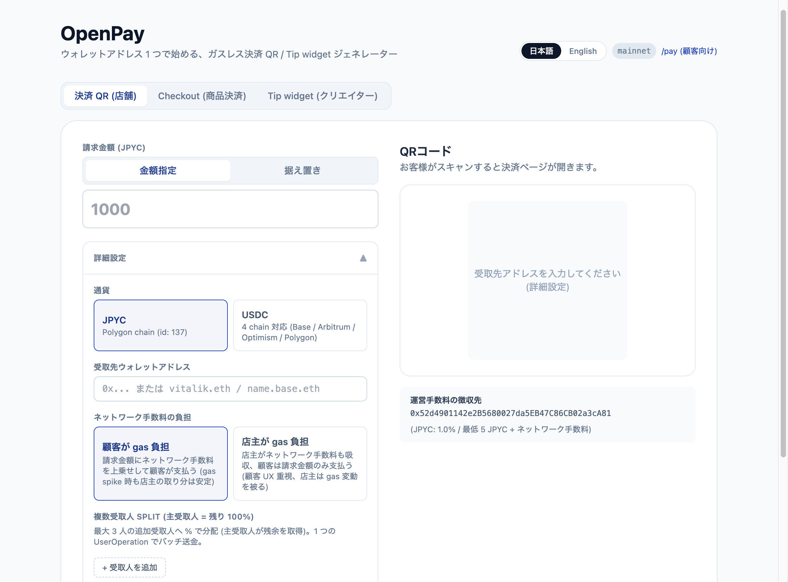

# OpenPay

<div align="center">
  
</div>

小規模店舗・クリエイター・フリーランスが**ウォレットアドレス1つだけ**で導入できる、オープンソースのガスレス決済 / Tip widget ジェネレーター。
ERC-4337 (Account Abstraction) + Pimlico Paymaster + ERC-7702 を組み合わせ、顧客はネイティブトークン (POL / ETH) を保有することなく **JPYC (Polygon)** または **USDC (Base / Arbitrum / Optimism / Polygon)** で決済できます。

- **JPYC (Polygon)**: 運営が POL ガスを肩代わり (Sponsorship Paymaster)
- **USDC (Base / Arbitrum One / Optimism / Polygon mainnet)**: 顧客が USDC のままガスを支払い (Pimlico ERC20 Paymaster)。運営のネイティブガス立替えなし
- **testnet (Base Sepolia / Arbitrum Sepolia / Optimism Sepolia / Polygon Amoy)**: USDC も sponsorship を使用 (顧客の testnet 用 ETH 入手の手間を省くための運用判断)

- `/{locale}` — 店舗向け QR / Checkout / Tip widget の 3 タブを 1 画面に集約
- `/{locale}/pay?to=...&token=...&chain=...&amount=...&split=0xB:30,0xC:20` — QR をスキャンした顧客の決済画面 (`chain=` で USDC のチェーンを選択、`split=` で複数受取人へ % 分配可能)
- `/{locale}/checkout?to=...&token=...&chain=...&items=name:qty:price,...&order_id=...&success_url=...&webhook=...` — Stripe Checkout 相当の itemized 決済画面 (line items 表示 + 注文 ID + 成功時 redirect + webhook)
- `/{locale}/tip/[address]?token=...&chain=...&name=...&message=...&color=...&preset=...&thanks=...&thanksUrl=...&webhook=...` — クリエイター向けチップ送金画面 (iframe 埋め込み対応 / 成功後の thanks メッセージ + リンク + webhook 通知)
- `{locale}` は `ja` (デフォルト) または `en`。middleware が Accept-Language で自動検出

**Repo**: https://github.com/cipherwebllc/openpay  
**License**: MIT

## 直近の主要追加 (v0.2 候補)

- **Phase 1 multi-chain USDC** — Base 限定から Base / Arbitrum One / Optimism / Polygon の **4 chain 対応** へ拡張。`/pay?token=usdc&chain=arbitrum` のような chain slug を URL で指定可能 (省略時は base 既定で旧 QR と互換)。Pimlico の `getTokenQuotes` で 4 chain × mainnet/testnet の全 8 deployment が valid な quote を返すことは `scripts/verify-pimlico-usdc.mjs` で確認済 (Universal Paymaster `0x7777777777...e66834C`)
- **Checkout (β)** — Stripe Checkout 相当の itemized 決済 URL を発行する新ルート `/checkout`。商品リスト (最大 10 件) + 注文 metadata + success_url redirect (3 秒自動) + webhook (Tip と互換シェイプ) を URL に埋め込む
- **Webhook 多重発火 fix** — `userOpHash` 単位で `useRef` gate し、gasQuote refetchInterval (30s) で breakdown が再計算されても 1 回限りの POST を保証
- **Sentry 直接統合** — `lib/logger.ts` から `Sentry.captureMessage / captureException` を呼出。default integration の breadcrumb のみだった旧経路を独立 event 化
- **rollback 制約の明文化** — multi-chain URL が出回った後の旧バージョン rollback は **silent fund misdirection** を起こすため、§ロールバック で禁止条件を明記
- **テスト** — 651 件 (lib mock 0、hook/component は外部 SDK 境界のみ mock)。coverage 97.46 / 95.49 / 90.27 / 97.46

## 特徴

| 項目 | 内容 |
| --- | --- |
| ガスレス (JPYC) | Pimlico Sponsorship (Verifying) Paymaster で運営が POL を肩代わり |
| ガスレス (USDC) | Pimlico ERC20 Paymaster で顧客が USDC のままガスを支払う (ETH 不要) |
| EOA をそのまま使用 | ERC-7702 によって、顧客の MetaMask 等の **既存 EOA 残高** で決済 (事前送金不要) |
| バッチ送金 | 「店主への送金」と「運営手数料」を 1 つの UserOperation にまとめて送信 |
| マルチチェーン | JPYC (Polygon) / USDC (Base / Arbitrum / Optimism / Polygon) を切替可能 |
| 登録審査不要 | 店主は自分のウォレットアドレスを入力するだけで QR を発行 |
| 据え置き QR / 金額指定 QR | 入店レジ用 (固定) と請求書用 (金額指定) 両対応 |
| 直接送金 (上級者) | ガス代を顧客負担にすることで運営手数料 0% で送金できるオプションモード |
| Tip widget (β) | iframe 1 行貼付でブログ・配信ページ・GitHub README に埋め込めるチップ送金 UI。固定 preset + カスタム金額、テーマカラー設定可。webhook は同一 userOpHash につき 1 回限りの POST (gasQuote refetch 耐性、`useRef` gate で実装) |
| Checkout (β)   | Stripe Checkout 相当の itemized 決済 URL を発行。line items + 注文 ID + 成功時 redirect + webhook (Tip と互換シェイプ)。e コマースの注文ごとに URL を発行する用途を想定 |

## 現金 / クレカ / PayPay との比較

| 項目 | 💴 現金 | 💳 クレジットカード² | 📱 PayPay¹ | ⚡ OpenPay |
| --- | --- | --- | --- | --- |
| **導入審査** | 不要 | 必要 (加盟店契約 + 審査) | 必要 (店舗登録 + KYC) | **不要** (ウォレットアドレス入力のみ) |
| **初期コスト** | レジ・釣銭準備 | 端末 + 月額利用料² | 端末 / QR スタンド申込 | **0 円** (印刷 QR で可) |
| **店舗受取手数料** | 0% | 約 3.25〜3.75%² (一部 5%超) | 1.60〜1.98%¹ | **1.0% + ネットワーク手数料 (見積)** / **0%** (直接送金モード) |
| **入金タイミング** | 即時 (店舗内) | 翌営業日〜月 1〜2 回² | 翌日〜月次¹ | **即時** (オンチェーン確定 数秒〜数十秒) |
| **チャージバック** | なし | あり (店舗負担リスク) | 一部あり | **なし** (オンチェーン確定で取消不可) |
| **釣銭** | 必要 (両替コスト・誤算リスク) | 不要 | 不要 | **不要** |
| **記帳** | 手動 / レジ閉め | カード会社管理画面 | 管理画面 | **オンチェーンで自動 + 改竄不可** |
| **海外顧客** | 両替が必要 | 国際ブランドで対応 (DCC 手数料あり) | 国内中心 | **グローバル** (USDC は世界共通通貨) |
| **紛失 / 盗難** | 物理リスクあり | 物理 (但し補償あり) | 限定的 | **秘密鍵管理のみ** |
| **顧客のガス代** | ─ | ─ | ─ | **JPYC: 0 円 (運営肩代わり) / USDC: USDC 建てで自動徴収 (ETH 不要)** |
| **ベンダーロック** | ─ | あり (カード会社契約) | あり (PayPay 内に閉じる) | **なし** (OSS / セルフホスト可) |
| **コード透明性** | ─ | クローズド | クローズド | **MIT / 全ソース公開** |

¹ PayPay の手数料・入金サイクルは加盟店プラン (PayPay マイストア plus 等) と申込条件で変動するため代表値を記載。  
² クレジットカードの手数料率・入金サイクル・端末コストは カード会社 / PSP (Square / Stripe / GMO ペイメントゲートウェイ 等) と業種・取扱高で大きく変動。Square / Stripe では端末月額無料・翌営業日入金プランあり、Visa/Master 系で 3.25%〜、Amex/Diners 系で 4〜7% が一般的。

### 現金より便利な理由 (店舗オーナー視点)

- **釣銭計算が消える**: 1 円単位で正確な金額が瞬時に確定し、両替・釣銭準備の負担ゼロ
- **レジ閉め作業が要らない**: 売上はオンチェーンに時系列で残るため、その日のうちに集計する手作業が不要
- **24 時間 365 日**: 無人レジ・自販機・夜間営業でも、店主が現場にいる必要なし
- **物理リスクが消える**: 偽札・盗難・紛失・水濡れ・摩耗、すべて関係なし
- **複数店舗の合算が即時**: 同一ウォレットアドレスを共有すれば全店売上が自動で集計される
- **海外旅行客にもそのまま**: USDC を選べば為替・両替手数料なしで世界中の顧客から受け取り可能

## 主なユースケース

OpenPay の構成要素 (programmable URL / multi-token / multi-chain / gasless / self-hostable) は店舗 QR 以外の使い方でもそのまま動きます。**追加の登録・コード変更なし**で以下のシナリオに使えます。

### 1. フリーランス・クリエイターの国際報酬受取

日本のイラストレーター / エンジニア / 翻訳者が海外クライアントから報酬を受け取る際、Wise や PayPal は **手数料 3〜5% + 着金 3〜7 営業日 + 書類処理** が要ります。OpenPay の請求 URL を発行してクライアントへ送れば、USDC で **即時着金 (オンチェーン確定 数十秒) / 手数料 1.0% + ガス見積 / 書類ゼロ** で受け取れます。

- 発行手順: `/` で USDC を選び、自分のウォレットアドレスを入力 → 金額指定 → URL or QR を発行 → クライアントへ送付 (メール / Slack / Notion 等で 1 行貼り付けるだけ)
- クライアント側に必要なのは EIP-7702 対応 EOA (MetaMask v12+) のみ。USDC のガス代は USDC 建てで自動徴収されるため ETH の保有は不要
- 着金履歴はそのままオンチェーンに残るため、事業所得の証憑として税務対応にも使える
- 国別規制: 受取人 (= 日本のフリーランス) 側は事業所得として確定申告すれば足りる。送付側 (海外クライアント) の規制は管轄国に依存

### 2. イベント / 同人誌即売会 / Web3 conference 物販

コミケ・技術書典・Web3 conference 等で、サークル主は **加盟店登録なし** に複数商品の決済 QR を即座に発行できます。PayPay や Square のような事前審査・端末手配は不要です。

- **1 商品 1 QR**: 商品名と固定金額で QR を生成 → 印刷して机に貼付 → 顧客がスキャンして即決済
- **海外参加者も即決済**: USDC を選べば来日した海外客が両替なしで支払い可能。JPYC を選べば国内 Web3 ユーザがそのまま使える
- **現金不要**: お釣り・偽札・盗難・水濡れリスクがすべて消える
- **複数販売員**: 同じウォレットアドレスを共有すれば、サークル全員の売上が自動で集計される
- **据え置き QR**: 単価が変動する商品 (応相談 / 投げ銭混じり) では、金額入力欄つきの据え置き QR を 1 枚貼っておくだけで運用可

商品点数が多い場合は 1 商品ずつ `/` で QR を生成する運用を想定。需要が増えれば CSV → 一括 QR 生成 (PDF / ZIP) を追加予定。

### 3. クリエイターの Tip widget 埋め込み (β)

イラストレーター・配信者・OSS maintainer 等が、ブログ・ポートフォリオ・配信ページ・GitHub README に **iframe 1 行貼付** でチップ送金 UI を組み込めます。pixivFANBOX / BOOST / Twitter tip 等は手数料 10〜15% + 月次入金 + 海外決済不可ですが、OpenPay は **手数料 1.0% + ネットワーク手数料 (見積) / 即時着金 / 海外 OK / JPYC + USDC 両対応**。

- 設定: `/` の「Tip widget」タブで受取アドレス・通貨・表示名・メッセージ・テーマカラー・preset 金額を入力 → URL と iframe スニペットを生成
- 埋め込み:
  ```html
  <iframe
    src="https://your-openpay.example.com/tip/0x...?token=jpyc&name=山田太郎&color=%231e3a8a"
    width="380" height="640" style="border:0;max-width:100%"
    title="OpenPay Tip" loading="lazy"
  ></iframe>
  ```
- ファンは MetaMask v12+ などで接続し、preset (JPYC: 300/1000/3000、USDC: 5/20/50) かカスタム金額を選んで送信。JPYC は運営がガスを肩代わり、USDC はファンの USDC 残高から自動徴収 (ネイティブトークン不要)
- iframe 埋め込みは `Content-Security-Policy: frame-ancestors *` で全オリジン許可 (アクションは MetaMask ポップアップで起こるためクリックジャッキング不成立)

### 4. Checkout (β) — Stripe Checkout 相当の itemized 決済 URL

e コマースサイトや注文書の発行で使う、商品リスト + 注文 metadata を埋め込んだ決済 URL を生成します。Stripe Checkout が手数料 2.9% + 30¢ なのに対し、OpenPay は **1.0% + ネットワーク手数料 (見積)** で、ガスレス (4337 + Pimlico ERC20 Paymaster)・即時着金・USDC 4 chain / JPYC Polygon 対応です。

- 発行: `/` の「Checkout」タブで受取アドレス・商品リスト (name × qty × price、最大 10 件)・注文 ID・success_url / cancel_url / webhook を入力 → `/checkout?...` URL + QR を生成
- 顧客 UX:
  - URL を開くと line items 一覧 + 合計 + ガス見積が表示される
  - 「支払う」を押すと **既存の `/pay` と同じ ERC-7702 + Pimlico ガスレスバッチ送金** で merchant 受取 + 運営手数料を 1 UserOp で実行
  - 成功後に `success_url` 指定なら 3 秒で自動 redirect (skip ボタン併設)、`tx_hash` / `user_op_hash` / `order_id` が query に付与される
- webhook: 成功時に **Tip と互換シェイプ** の JSON を POST (`type: "openpay.checkout.success"` + `items`, `orderId`, `merchantAmount` 等)。マーチャントは Tip と同じ handler に分岐 1 行追加で両対応可能
- **重要 (セキュリティ)**: webhook payload と success_url の query は顧客側で改ざん可能 (Stripe の `whsec_` 署名相当の保証なし)。**マーチャントは webhook 受信後に必ず `tx_hash` をオンチェーンで再検証**してから注文を確定してください
- 制約: line items 最大 10 件 / name 80 文字 / qty 1〜999 / price は token decimals 以内。bridged USDC.e は不可 (native USDC のみ)

```
/checkout?to=0x...&token=usdc&chain=arbitrum
        &items=Tシャツ:1:25,マグ:2:15
        &order_id=ord-12345
        &success_url=https://shop.example.com/thanks
        &webhook=https://shop.example.com/openpay-webhook
```

## 対応ネットワークと選定理由

| トークン | チェーン | ガス通貨 | 採否 | 理由 |
| --- | --- | --- | --- | --- |
| JPYC v3 | **Polygon** | POL | ✅ 採用 | JPYC v3 (`0xE7C3…3c29`) が Polygon 上で発行され、DEX/ブリッジ/オンランプの流動性が集中。日本国内の JPYC ユーザの主要居住地 |
| USDC (native) | **Base** | ETH | ✅ 採用 | Circle 公式 native USDC (`0x8335…2913`)。Coinbase ウォレット経由のオンランプが容易、低ガス、Base 系 dApp との互換性。`/pay?token=usdc` 既定 |
| USDC (native) | **Arbitrum One** | ETH | ✅ 採用 | Circle 公式 native USDC (`0xaf88…5831`)。L2 で最大規模の TVL、bridged USDC.e と区別される native 版 |
| USDC (native) | **Optimism** | ETH | ✅ 採用 | Circle 公式 native USDC (`0x0b2C…Ff85`)。Superchain エコシステム中心の決済チェーン |
| USDC (native) | **Polygon PoS** | POL | ✅ 採用 | Circle 公式 native USDC (`0x3c49…3359`)。JPYC ユーザと同じ Polygon 上で USDC を選択可能 |
| JPYC | Ethereum | ETH | ❌ 不採用 | ガス代が決済額に対して高すぎる (5 JPYC の運営手数料 + 数百円 gas) |
| JPYC | Avalanche | AVAX | ❌ 不採用 (一旦様子見) | Avalanche 上の JPYC は **DEX ペアの流動性がほぼゼロ**。手数料を AVAX に変換するルートがクロスチェーンになり、ガス調達が常に赤字。日本のリテールユーザの利用が限定的 |
| JPYC | Base / Arbitrum / Optimism | ─ | ❌ 発行なし | JPYC v3 はこれらのチェーン上に **発行されていない**。JPYC 公式が他チェーンへ展開した場合のみ追加検討 |
| USDC (bridged) | 各 chain (USDC.e) | (各 chain ガス) | ❌ 不採用 | bridged 版は Pimlico ERC20 Paymaster の対応が不安定。OpenPay は **native USDC のみ** 対応 |

### 運用上の含意 (JPYC / Polygon)

1. 顧客の決済ごとに Pimlico Sponsorship Paymaster は **POL を消費**する
2. 運営は手数料 1.0% (JPYC) を **JPYC** で受け取る
3. 運営は定期的に **JPYC → POL** に swap して Pimlico 残高を補充する必要がある
   - JPYC/POL の DEX ペアは流動性が薄いため、実務的には **JPYC → USDC → POL** の 2-hop swap (QuickSwap / Uniswap v3 on Polygon) が現実的
   - 自動化案: OpenZeppelin Defender Sentinel / cron + viem による定期 swap
4. JPYC 1.0% / 5 JPYC の料率は純マージンとして設定 (gas は別建て徴収)。`NEXT_PUBLIC_POL_JPYC_RATE` で POL→JPYC 換算レートを実勢に合わせて月次で見直してください。`lib/gasCeiling.ts` の上限を超える gas spike では UserOp が早期 abort され、運営の POL 立替不足を防ぐ仕様 (詳細は「Gas price ceiling」節)

### 運用上の含意 (USDC / 全 4 chain)

1. ガス代は **顧客が USDC のままで支払う**ため、運営はネイティブ ETH/POL を立替えない (Sponsorship Paymaster と異なり残高補充の運用が要らない)
2. 内部実装は Pimlico の **ERC20 Paymaster** + permissionless `prepareUserOperationForErc20Paymaster` を使用。UserOp の calls 先頭に paymaster コントラクトへの USDC `approve` が自動注入される (既に十分な allowance がある場合はスキップ)
3. 顧客が UI で見る支払額は `決済額 + 運営手数料 + ガス代見積 (USDC 建て)`。ガス代は worst-case 見積で表示し、実費が下回れば超過分は引き落とされない
4. **chain ごとに Pimlico の token quote を取得**し、その chain の ETH/POL ↔ USDC レートで gas を換算する (`hooks/useGasQuoteUsdc.ts`)。chain 切替時は自動で再取得
5. URL に `chain=` パラメタが無い場合は **Base にフォールバック** (既存 QR との互換性確保)
6. testnet (Base Sepolia / Arbitrum Sepolia / Optimism Sepolia / Polygon Amoy) では USDC でも **自動的に Sponsorship Paymaster にフォールバック**する (`lib/pimlico.ts:resolvePaymasterMode`)。これは顧客が testnet 用 USDC + ETH を両方用意せずに動作確認できるようにする運用判断
7. **bridged USDC.e は対応外**。Circle 公式 native USDC コントラクト以外を `NEXT_PUBLIC_USDC_<chain>_<env>_ADDRESS` に指定すると Pimlico Paymaster がエラーを返す可能性が高い

### 将来の拡張余地

- Ethereum mainnet / Unichain / Linea / Celo / Scroll 等の追加は `lib/tokens.ts` (USDC deployment 追記) と `lib/chains.ts` (slug 追加) の 2 箇所への追記で完結。**実需要が確認できてから追加**する方針
- JPYC の Base / Arbitrum 等への拡大は **JPYC 公式の他チェーン発行待ち**。現状 JPYC v3 は Polygon 上のみで発行されているため OpenPay も Polygon 単一で運用

## アーキテクチャ

```
┌────────────────────────────────────────────────────────┐
│ 店主 (any EOA)                                         │
│  └─ /                  QR ジェネレーター画面            │
│       (LocalStorage に設定保存)                        │
└────────────────────────────────────────────────────────┘
              │ QR (URL: /pay?to=...&token=...&fee=...&amount=...)
              ▼
┌────────────────────────────────────────────────────────┐
│ 顧客 (any EOA - MetaMask / Coinbase / WC)              │
│  └─ /pay               決済画面                        │
│       1. URL parse                                     │
│       2. ウォレット接続 (wagmi)                          │
│       3. 必要チェーンへ自動切替                          │
│       4. ERC-7702: EOA を Smart Account 化              │
│       5. token に応じて Paymaster を選択                │
│          - JPYC: Sponsorship (運営が POL を肩代わり)    │
│          - USDC: ERC20 Paymaster (顧客が USDC で支払い) │
│       6. ERC20.transfer × 2 (店主 / 運営) を batch       │
│          (USDC は paymaster への approve も先頭に注入)  │
│       7. UserOperation 送信 → receipt 表示              │
└────────────────────────────────────────────────────────┘
```

## ディレクトリ構成

```
openpay/
├── app/
│   ├── layout.tsx
│   ├── providers.tsx                # WagmiProvider + ReactQuery
│   ├── globals.css
│   ├── page.tsx                     # / (店主向け QR + Tip widget タブ)
│   ├── pay/page.tsx                 # /pay (顧客向け決済)
│   └── tip/[address]/page.tsx       # /tip/[address] (クリエイター Tip 受取)
├── components/
│   ├── ConnectButton.tsx
│   ├── Field.tsx                    # 共有: ラベル付き入力ラッパー
│   ├── Row.tsx                      # 共有: 明細用 dt/dd 行
│   ├── QrGenerator.tsx
│   ├── PaymentForm.tsx
│   ├── TipForm.tsx                  # /tip/[address] のメイン UI
│   └── TipEmbedGenerator.tsx        # /` の Tip widget タブ
├── hooks/
│   ├── useQrSettings.ts             # LocalStorage: QR 生成設定
│   ├── useTipSettings.ts            # LocalStorage: Tip widget 生成設定
│   ├── useSmartAccount.ts           # ERC-7702 + Pimlico
│   ├── useBatchPayment.ts           # バッチ UserOperation
│   └── useDirectPayment.ts          # 直接送金モード (mode=direct)
├── lib/
│   ├── env.ts                       # 環境変数の単一参照点
│   ├── chains.ts                    # mainnet/testnet 切替
│   ├── tokens.ts                    # JPYC / USDC 定義
│   ├── fee.ts                       # チェーン別料率 / MIN_FEE 計算
│   ├── gasCeiling.ts                # チェーン別 gas 上限 / GasCongestedError
│   ├── url.ts                       # /pay /tip URL ビルド/パース
│   ├── storage.ts                   # LocalStorage helpers
│   ├── logger.ts                    # 構造化 JSON ログ
│   ├── wagmi.ts                     # wagmi config + 3 connectors
│   └── pimlico.ts                   # Pimlico bundler/paymaster client
├── tests/
│   ├── _helpers/wagmiMock.ts        # mockHook<F>: 部分モック用 typed helper
│   ├── components/                  # RTL コンポーネントテスト
│   ├── hooks/                       # フックの境界テスト
│   └── lib/                         # 純関数テスト
├── package.json
├── next.config.mjs                  # /tip/* に CSP frame-ancestors を付与
├── tailwind.config.ts
└── .env.local.example
```

## 前提条件 (本番運用に必要な外部アカウント / 設定)

ローカル開発だけなら **Pimlico API Key の準備のみ** で動きます。本番デプロイには下記すべてが必要です。

| サービス | 必要な理由 | コスト | 設定箇所 |
|---|---|---|---|
| **Pimlico** ([dashboard.pimlico.io](https://dashboard.pimlico.io)) | ガスレス送金の bundler + paymaster (JPYC=Sponsorship / USDC=ERC20) | 従量課金 (Sponsorship 分のみ) | `NEXT_PUBLIC_PIMLICO_API_KEY` + Sponsorship Policy ID |
| **WalletConnect / Reown** ([cloud.reown.com](https://cloud.reown.com)) | WalletConnect ウォレット接続 (任意、未設定時は除外される) | 無料枠あり | `NEXT_PUBLIC_WC_PROJECT_ID` |
| **Sentry** ([sentry.io](https://sentry.io)) | エラー追跡 + Replay (10% / エラー時 100%) | 無料枠あり | `NEXT_PUBLIC_SENTRY_DSN` (Plain) + `SENTRY_AUTH_TOKEN` (Sensitive) |
| **Vercel** ([vercel.com](https://vercel.com)) | Next.js デプロイ + middleware (i18n routing) | Hobby 無料 | プロジェクトインポート + env 投入 |
| **Ethereum mainnet RPC** (任意推奨) | ENS (.eth) / Basenames (.base.eth) 解決 — 既定の publicnode.com に SLA なし | Alchemy / Infura 無料枠あり | `NEXT_PUBLIC_MAINNET_RPC_URL` (CCIP-Read 必須) |
| **GitHub Secrets** | Pimlico balance cron / Lighthouse / Playwright workflow 用 | 無料 | repo Settings → Secrets (詳細は「監視 / アラート」節) |
| **Webhook (Slack/Discord/PagerDuty)** | Pimlico 残高アラート通知先 | 無料 | `ALERT_WEBHOOK_URL` (GitHub Secrets) |
| **EIP-7702 対応ウォレット** (顧客側) | gasless 送金は ERC-7702 が必須 | 無料 | MetaMask v12 系以降の安定版 |

**Coinbase Wallet / 一部の WalletConnect ウォレットは ERC-7702 未対応** の可能性があります。本番投入前に testnet (Polygon Amoy / Base Sepolia) で実 wallet と接続して 1 件送金成功を確認してください。

## セットアップ

### 1. クローン + 依存パッケージのインストール

```bash
git clone https://github.com/cipherwebllc/openpay.git
cd openpay
npm install
```

このコマンドで `package-lock.json` が生成されます。**初回 push 前に必ずコミット**してください — CI (`.github/workflows/ci.yml`) は `npm ci` でインストールするため、lockfile がないと **CI が初回実行で失敗します**。

```bash
git add package-lock.json
git commit -m "Lock dependencies"
```

(プロジェクトを新規に作る場合は以下のコマンドで同じ依存を取得できます)

```bash
npm install \
  next@^15 react@^19 react-dom@^19 \
  viem@^2.21 wagmi@^2.13 @tanstack/react-query@^5.59 \
  permissionless@^0.2.30 qrcode.react@^4
npm install -D \
  typescript @types/node @types/react @types/react-dom \
  tailwindcss postcss autoprefixer \
  eslint eslint-config-next
```

### 2. 環境変数

`.env.local.example` を `.env.local` にコピーし、以下を埋めます。

| 変数 | 必須 | 値 |
| --- | --- | --- |
| `NEXT_PUBLIC_NETWORK_ENV` | ◯ | `mainnet` または `testnet` |
| `NEXT_PUBLIC_PIMLICO_API_KEY` | ◯ | [Pimlico Dashboard](https://dashboard.pimlico.io) で発行した API Key |
| `NEXT_PUBLIC_PIMLICO_SPONSORSHIP_POLICY_ID` | ◯ (JPYC 用 / USDC は不要) | Pimlico の Sponsorship Policy ID (例: `sp_xxxx`)。USDC は ERC20 Paymaster なので未指定でも動く |
| `NEXT_PUBLIC_FEE_RECEIVER_ADDRESS` | ◯ | 運営手数料の受取アドレス |
| `NEXT_PUBLIC_WC_PROJECT_ID` | △ | [Reown Cloud](https://cloud.reown.com) で発行した WalletConnect Project ID。未設定時は WalletConnect 連携が無効化される |
| `NEXT_PUBLIC_*_RPC_URL` | × | 公開 RPC が混雑する場合に Alchemy/Infura 等の URL を指定 (Base / Arbitrum / Optimism / Polygon 各 mainnet/sepolia) |
| `NEXT_PUBLIC_JPYC_TESTNET_ADDRESS` | × | testnet で独自に発行した JPYC を指定する場合に上書き |
| `NEXT_PUBLIC_USDC_<chain>_<env>_ADDRESS` | × | 対応 4 chain × mainnet/testnet で USDC コントラクトを上書き (例: `NEXT_PUBLIC_USDC_ARBITRUM_MAINNET_ADDRESS`)。bridged USDC.e は非対応 — native USDC のみ |
| `NEXT_PUBLIC_GAS_CEILING_POLYGON_GWEI` | × | Polygon mainnet の `maxFeePerGas` 上限 (gwei、整数)。既定 200。Sentry の `gas_congested` 件数を見て調整 |
| `NEXT_PUBLIC_GAS_CEILING_BASE_GWEI` | × | Base mainnet の `maxFeePerGas` 上限 (gwei、整数)。既定 1。L2 のみで判定 (L1 calldata は別軸監視) |
| `NEXT_PUBLIC_GAS_CEILING_ARBITRUM_GWEI` | × | Arbitrum One の `maxFeePerGas` 上限 (gwei、整数)。既定 1 |
| `NEXT_PUBLIC_GAS_CEILING_OPTIMISM_GWEI` | × | Optimism の `maxFeePerGas` 上限 (gwei、整数)。既定 1 |
| `NEXT_PUBLIC_GAS_QUOTE_OVERHEAD_GAS` | × | USDC ERC20 Paymaster の「最大ガス代」見積に使う UserOp gas 単位 (整数)。既定 500_000 は実機計測前の rough な値、本番計測後に調整 |

### 3. Pimlico ダッシュボード設定

1. [https://dashboard.pimlico.io](https://dashboard.pimlico.io) でアカウント作成し API Key を発行
2. **本番運用時は必ず "Origin (ドメイン) 制限" を有効化**してください。`NEXT_PUBLIC_PIMLICO_API_KEY` はクライアントバンドルに含まれるため、Origin 制限なしでは API Key が悪用される可能性があります
3. **Sponsorship 残高をデポジット (JPYC 用)**:
   - `mainnet`: Polygon (POL)
   - `testnet`: Polygon Amoy (POL) / Base Sepolia (ETH) / Arbitrum Sepolia (ETH) / Optimism Sepolia (ETH) ※ testnet では USDC も sponsorship にフォールバックするため対応 4 chain 全ての L2 ETH が必要
   - **mainnet の USDC (Base / Arbitrum / Optimism / Polygon) は ERC20 Paymaster 経由で顧客が払うため Sponsorship 残高デポジットは不要**
4. **Sponsorship Policy** を作成し、その `policyId` を `NEXT_PUBLIC_PIMLICO_SPONSORSHIP_POLICY_ID` に設定 (JPYC で適用される。USDC mainnet 用には別途設定不要)
5. **濫用対策ルール** を Policy に必ず設定 (これがないと、誰かが任意の `/pay` URL を生成して運営の sponsorship 残高を消費できる)。**JPYC (Polygon) のみが対象** (USDC は ERC20 Paymaster なので濫用余地なし — 顧客が払う):
   - `to address allowlist`: JPYC コントラクト (mainnet: `0xE7C3...3c29` / Polygon Amoy: 自分のテストデプロイ)
   - `function selector allowlist`: `transfer(address,uint256)` (`0xa9059cbb`) のみ
   - `data parameter constraint`: 受取人パラメータの 1 つが必ず `NEXT_PUBLIC_FEE_RECEIVER_ADDRESS` であること (= 運営手数料 transfer を含む UserOp のみ sponsor)
   - **gas price 上限**: `lib/gasCeiling.ts` の Polygon 値 (200 gwei) と同等以上を Policy に設定。クライアント側ガードはユーザ向け早期エラー、Policy 側は改竄不可な最終防衛線として機能 (二重ガード)
   - クライアント側でも sponsorship mode のとき `useBatchPayment` が `feeAmount > 0` と `assertGasCeiling` を assertion して defense in depth (ERC20 mode では顧客が支払うため gas ceiling は不要)

### 4. 開発サーバー

```bash
npm run dev
```

[http://localhost:3000](http://localhost:3000) を開いてください。

## 言語サポート

UI は日本語 (default) と英語の 2 言語対応。`next-intl` v4 + middleware 検出で `/ja/...` / `/en/...` に自動 routing。ヘッダー右上の言語スイッチャーで切替可能。

- 文字列リソース: `messages/ja.json` / `messages/en.json`
- 新しい locale 追加: `i18n.ts` の `LOCALES` に追加 + `messages/{locale}.json` を作成
- ロケール非依存ルート (`/manifest.webmanifest`, `/icon.svg` 等) は middleware の matcher で除外済み

## 使い方

### 店主側 (QR 発行)

1. `/` を開く
2. 通貨 (USDC / JPYC)・受取アドレスを入力 (LocalStorage に保存)
3. **金額指定 QR**: 請求金額を入力 → 一回限りの QR が生成
4. **据え置き QR**: 金額入力なしで生成 → 顧客が金額入力する据え置き QR
5. QR を印刷 / 表示。または URL コピーで送付

### 顧客側 (決済)

1. QR をスキャン → `/pay?to=...&token=...&fee=...&amount=...` が開く
2. ウォレット接続 (MetaMask / Coinbase Wallet / WalletConnect)
3. 必要なら自動でネットワーク切替を促す
4. (据え置き QR の場合は) 金額を入力
5. 「○○ を支払う」ボタンで送金完了
6. UserOp Hash・Tx Hash・ブロック番号を表示

### クリエイター側 (Tip widget 設置)

1. `/` を開いて「Tip widget (クリエイター)」タブに切替
2. 受取アドレス・通貨 (JPYC / USDC)・表示名・メッセージ・テーマカラー・preset 金額を入力
3. プレビューを確認 → URL or iframe スニペットをコピー
4. ブログ・ポートフォリオ・配信ページの HTML に貼り付け
5. ファンが iframe 内のボタンをクリック → ウォレット接続 → preset/カスタム額で送信

Tip widget はクリエイターが preset 額をそのまま受け取り、ファンが運営手数料 + ネットワーク手数料 (見積) を上乗せして支払います (内訳・MIN_FEE は通常決済と同じ)。

## 手数料の計算

**運営手数料は常に店主負担** (SaaS / カード決済の販売手数料的な固定コスト、顧客には不可視)。
QR 発行時に店主が **ネットワーク手数料の負担者** を選択:

### `gas=customer` モード (default)
顧客がネットワーク手数料を上乗せ支払い。**店主の取り分は gas spike に左右されず安定**。

| 項目 | 計算 |
|---|---|
| 顧客支払額 | `amount + gasQuote` |
| 店主受取 | `amount - fee` |
| 運営取分 | `fee` (固定。sponsorship 時は + gas 相当 を Pimlico への POL 精算に充当) |

### `gas=merchant` モード
店主がネットワーク手数料も吸収。**顧客は表示金額のみ支払う** (内税的 UX)。

| 項目 | 計算 |
|---|---|
| 顧客支払額 | `amount` |
| 店主受取 | `max(0, amount - fee - gasQuote)` |
| 運営取分 | `fee` (固定。sponsorship 時は + gas 相当) |

`amount < fee + gasQuote` (gas=merchant) または `amount < fee` (gas=customer) で店主受取が 0 になるため、PaymentForm で送信を block して運営の赤字 + on-chain 失敗を未然防止。Tip widget は preset セマンティクス維持のため `gas=customer` 固定 (creator 受取 = preset - fee、ファン支払 = preset + gas)。

### 料率 (`lib/fee.ts`)
| token | 料率 | MIN_FEE | 備考 |
|---|---|---|---|
| JPYC (Polygon) | 1.0% | 5 JPYC | 純マージン (両 mode 共通) |
| USDC (Base / Arbitrum / Optimism / Polygon) | 1.0% | 0.05 USDC | 純マージン (両 mode 共通) |

### ネットワーク手数料の徴収経路
| paymaster | gas を払う主体 | 経路 | 運営の精算 |
|---|---|---|---|
| ERC20 Paymaster (USDC) | 顧客の USDC | paymaster が postOp で実 gas 分を顧客 USDC から自動徴収 | なし (paymaster が ETH gas 立替・自己精算) |
| Sponsorship (JPYC) | (gas=customer 時) 顧客の JPYC、(gas=merchant 時) 店主が merchant 控除で吸収 | fee transfer に gas 相当 (POL 建て見積 × `NEXT_PUBLIC_POL_JPYC_RATE`) を内包し feeReceiver へ | 運営は徴収した JPYC で Pimlico への POL gas を別途精算 (off-chain) |

旧 `fee=include`/`fee=exclude` URL パラメタは廃止 (parser は silently ignore して古い QR を破壊しない)。新規 QR は `gas=merchant` を明示 (default = customer は URL に出さない)。

### Gas price ceiling (混雑時の安全弁)

`lib/gasCeiling.ts` で UserOp 送信前の `maxFeePerGas` をチェーン別に上限判定し、超過していれば `GasCongestedError` を投げてユーザに「ネットワーク混雑」エラーを返します。**両 paymaster mode で適用** (`useBatchPayment.ts`):

- **Sponsorship mode (JPYC)**: 運営の POL 立替コスト上限保護。極端な spike 時は徴収した JPYC では POL gas を補填しきれない可能性があるため送信前に弾く。
- **ERC20 Paymaster mode (USDC)**: 顧客の USDC 出費の上限保護。Base 1 gwei (既定 ceiling) で gas は約 1.6 USDC、これを超える spike は USDC 換算で高額になるため送信前に弾く。

| チェーン | 既定上限 | env 上書き |
| --- | --- | --- |
| Polygon (137) | 200 gwei | `NEXT_PUBLIC_GAS_CEILING_POLYGON_GWEI` |
| Base (8453) | 1 gwei (L2) | `NEXT_PUBLIC_GAS_CEILING_BASE_GWEI` (testnet fallback 用) |
| Polygon Amoy / Base Sepolia | 1000 gwei (緩) | (testnet 固定) |

運用フェーズでは Sentry の `gas_congested` イベントを監視して再デプロイなしで上限値を調整できる設計。Pimlico Sponsorship Policy 側にも同等以上の上限を設定すること (二重ガード)。

> ⚠️ Base の上限は L2 `maxFeePerGas` のみで判定するため、Ethereum mainnet の L1 spike (200+ gwei) で押し上げられる L1 calldata 費は捕らえられません。L1 監視は今後の拡張ポイント。

## Vercel デプロイ

リポジトリを Vercel にインポートし、上記の環境変数をプロジェクト設定にコピーしてください。  
`next build` がそのまま通る素の Next.js (App Router) 構成のため、追加設定は不要です。

```bash
npm run build && npm run start
```

### Vercel 環境変数のセキュリティ分類

[2026-04 の Vercel セキュリティインシデント](https://vercel.com/kb/bulletin/vercel-april-2026-security-incident) を踏まえ、各 env を以下に従って Dashboard で登録:

| env var | Vercel での分類 | 理由 |
|---|---|---|
| `NEXT_PUBLIC_*` (全て) | **Plain (non-sensitive)** | ビルド時にクライアントバンドルへインライン展開される設計上、元々公開情報。Sensitive にしても保護にならない |
| `SENTRY_AUTH_TOKEN` | **Sensitive (暗号化)** ✓ 必須 | source map upload 権限を持つ。漏洩すると Sentry プロジェクトの source map 改竄リスク。今回のインシデントで Sensitive 化されていない env vars が漏洩対象になったため、本 token は必ず Sensitive で保管 |

### Vercel 運用ハードニング (mainnet 切替前に全て実施)

| 項目 | 実施場所 | 理由 |
|---|---|---|
| アカウントの **MFA 有効化** | Vercel Dashboard → Account Settings → Authentication | 今回の事象は employee の Google アカウント乗っ取りが起点。顧客アカウントの MFA は基本対策 |
| **Spending Cap を $0 に固定** | Vercel Dashboard → Settings → Billing | 限度超過で **デプロイ停止** (請求発生せず)。検証段階は特に重要 |
| **Audit Log 確認** | Vercel Dashboard → Settings → Activity | 不審な Deployment / Settings 変更が無いか定期確認 |
| **Pimlico API Key の Origin 制限** | Pimlico Dashboard | `*.vercel.app` の preview ドメイン群 + production ドメインに限定 |
| **Pimlico Sponsorship Policy ルール** | Pimlico Dashboard | README "Pimlico ダッシュボード設定" 5 項参照 (fee_receiver への transfer 必須化) |
| **Sentry DSN 設定** | Vercel env (Plain) | Replay (10% / エラー時 100%) + 例外取得が自動有効化 |
| **`SENTRY_AUTH_TOKEN` を Sensitive で登録** | Vercel env (Sensitive) ✓ | 上記表参照 |
| **GitHub Secrets の見直し** | GitHub repo → Settings → Secrets | Pimlico 残高 cron / Lighthouse / Playwright 用の secrets は GitHub 側にあり、Vercel インシデントの影響を受けない (= 移行不要) |
| **testnet で先に e2e** | Polygon Amoy / Base Sepolia | NETWORK_ENV=testnet で実 wallet を繋いで `/ja/pay` `/ja/tip` の送金成功を確認してから mainnet に切替 |

## 本番投入前に必ず検証すべきポイント (未検証 / LARP リスク)

本リポジトリは MVP プロトタイプであり、以下の事項は **コード生成時点で実環境検証ができていない**。本番環境にデプロイする前に必ず確認してください。

### 0. テストの mock 比率 (透明化)

本リポジトリの自動テスト (636 件) における mock 利用方針:

| 層 | mock 使用 | 実コード走行範囲 |
|---|---|---|
| `tests/lib/*` (14 ファイル) | **0 件 — mock 一切なし** | 全 lib モジュールを実 import で評価 (env / chains / fee / gasCeiling / pimlico / storage / tokens / url / wagmi 等)。`vi.resetModules()` で env の差替えも実 module 再評価 |
| `tests/hooks/*` (6 ファイル中 5 が mock 利用) | wagmi / @tanstack/react-query / permissionless の境界のみ mock | 対象 hook (useBatchPayment / useSmartAccount / useGasQuote* / useQrSettings 等) のロジックは実コード走行。Smart Account 構築の **完全 mock 解除版は無い** (実 wallet + funded sponsorship + ERC-7702 署名が必要なため → §4-1 runbook 参照) |
| `tests/components/*` (9 ファイル中 9 が mock 利用) | wagmi (useAccount / useReadContract 等) と各 hook の境界 mock | コンポーネント描画・分岐ロジック・event handler は実走行。`fake timers + act` で 3 秒 redirect カウントダウンの状態遷移を実観測 |
| `e2e/*` (3 spec) | Playwright で実ブラウザ + dev server 走行 | URL parse / UI 描画は実環境、send は wallet 接続必須なので CI で skip |

実 import 走行率が高い: lib 100%、hook の query/mutation ロジック 100%、コンポーネントの描画/分岐 100%。**mock されているのは外部 SDK の境界 (wallet 接続・実 RPC) のみ**で、本リポジトリのテスト対象自身ではない。

### 1. permissionless.js の API 名

`hooks/useSmartAccount.ts` は `permissionless@^0.2.30` から **`to7702SimpleSmartAccount`** を import している (`tests/hooks/useSmartAccount.test.tsx` で import 解決を smoke check 済)。permissionless 側でリネーム/移動が起きた時はこの import が壊れて CI が即落ちる。

### 2. JPYC mainnet コントラクトアドレス

`lib/tokens.ts` の既定値は **JPYC v3 (Polygon): `0xE7C3D8C9a439feDe00D2600032D5dB0Be71C3c29`** です (プロジェクト所有者により確認済)。  
JPYC は将来的に新バージョンへの移行や別チェーン拡張が起こる可能性があるため、本番投入前に [JPYC 公式](https://jpyc.jp/) で**最新のコントラクトアドレスを再確認**してください。不一致がある場合は `NEXT_PUBLIC_JPYC_MAINNET_ADDRESS` で上書き可能です。

> ⚠️ **誤ったアドレスを mainnet で稼働させると顧客資金が失われます。** デプロイ前に必ず公式ソースとの突合を実施してください。

### 3. ERC-7702 の実フロー

`useSmartAccount` の queryFn (`to7702SimpleSmartAccount` → `createSmartAccountClient`) は **どの自動テストでも実行されていない**。理由:
- 完全モックすると "実コードを試していない" のと等価になる
- 実コードを動かすには Pimlico API key + funded sponsorship policy + ERC-7702 対応ウォレットの実署名が必要

検証は testnet で `npm run dev` し、実際にスキャン → 送金してください (README の「統合テスト (e2e)」節)。

### 4. Pimlico Sponsorship Policy の挙動

policyId が無い場合の Pimlico 既定挙動 (sponsor するか reject するか) は Pimlico ダッシュボードのアカウント設定に依存する。**本番投入前に必ず policyId を明示設定** してください。

### 4-1. USDC mainnet (ERC20 Paymaster) 投入 runbook

USDC は Base / Arbitrum / Optimism / Polygon の 4 chain で **ERC20 Paymaster mode** を採用し、顧客が USDC で gas を支払う。

> ⚠️ **未検証範囲 (LARP リスク)**:
>
> - `scripts/verify-pimlico-usdc.mjs` で **Pimlico の `getTokenQuotes` が 4 chain × mainnet/testnet の全 8 deployment で valid な quote を返すこと** は確認済み (Universal Paymaster `0x7777777777...e66834C` が有効)
> - **しかし**、Smart Account → bundler → 実 execution → ERC20 Paymaster の `postOp` で実際に USDC が顧客から徴収される **全段の動作** は本リポジトリ内では検証していない (実 wallet + funded USDC + ERC-7702 署名が必要)
> - 既存の Base mainnet 運用の延長で Arbitrum / Optimism / Polygon mainnet を一気に有効化する設計だが、**段階展開を推奨**: Base で実績確認 → Arbitrum (testnet 検証) → Optimism → Polygon の順
> - ERC-7702 (EIP-7702) は Pectra (2025-05) 以降の各 L2 に順次展開された。本番投入前に対象 chain の hard fork 状況を再確認
> - bridged USDC.e は **非対応**。`NEXT_PUBLIC_USDC_<chain>_<env>_ADDRESS` には必ず Circle 公式 native USDC を指定

投入時は以下を **手順通り** 実施すること:

**事前 (deploy 前)**

1. Pimlico Dashboard で Base mainnet の API key に Origin 制限 (本番ドメイン) を設定
2. Pimlico Dashboard の **Token Paymaster** セクションで Base mainnet + USDC `0x833589fCD6eDb6E08f4c7C32D4f71b54bdA02913` が有効化されているか確認 (Pimlico 側で paymaster 起動が必要な場合あり)
3. **Pimlico プランの rate limit を Dashboard で確認**: 想定同時アクティブ checkout セッション数 × `useGasQuote*` の refetch 頻度 (現状 30s 間隔 → 1 user/120 calls/h) が当該プランの **per-API-key requests/sec** 上限を超えないこと。超える可能性がある場合は `lib/useGasQuoteUsdc.ts` / `useGasQuoteJpyc.ts` の `refetchInterval` を引き上げるか上位プランへ
4. `lib/gasCeiling.ts` の Base 1 gwei ceiling が現在の Base 平常 gas (典型 0.001-0.01 gwei) より十分高いか確認 — `NEXT_PUBLIC_GAS_CEILING_BASE_GWEI` で調整可
5. `NEXT_PUBLIC_GAS_QUOTE_OVERHEAD_GAS` 未設定なら 500_000 が使われる。Pimlico の dashboard 等で実 UserOp 計測ができれば事前に値を埋めておく

**deploy 直後 (最初の 1 件)**

6. `NETWORK_ENV=mainnet` で deploy
7. **運営自身のウォレットで** `/pay?to=<運営テストアドレス>&token=usdc&amount=1.0` を実行 (1 USDC + 運営手数料 0.05 USDC + gas 見積 ≈ 0.05〜2 USDC、最小 USDC 残高 5 USDC 程度推奨)
8. 確認項目:
   - 「ネットワーク手数料 (見積)」行に `最大 X.XX USDC` が表示されること
   - approve トランザクション (paymaster コントラクト宛) が UserOp の calls 先頭に含まれること (BaseScan で内部 tx を確認)
   - 顧客の USDC 残高が `merchant + fee + 実 gas` だけ減っていること (見積より実費が低ければ余剰は引かれない)
   - 運営の Base ETH は **使われていない** (= ETH 立替えゼロが達成されている)

**最初の 24h 監視 (Sentry イベントで)**

| イベント名 | 期待値 | 異常 → アクション |
|---|---|---|
| `payment.gas-quote.failed` | 0 件/h | Pimlico mainnet `pimlico_getTokenQuotes` の 5xx → Pimlico サポート連絡 |
| `payment.failed` (ERC20 mode) | < 1% of attempts | 急増 → `DEFAULT_USEROP_GAS_UNITS` 不足の可能性、`NEXT_PUBLIC_GAS_QUOTE_OVERHEAD_GAS=700000` 等で増やす |
| `gas_congested` | spike 時のみ | 平常時に頻発するなら `NEXT_PUBLIC_GAS_CEILING_BASE_GWEI` を 2 gwei に緩和 |

**即 rollback トリガー**

- `payment.failed` が **5%/h** を超え、エラーメッセージに `paymaster validation failed` / `AA34` / `AA37` (paymaster 関連) が含まれる場合 → Vercel で旧 deploy へ rollback
- 顧客から「USDC が引かれたが merchant が受け取っていない」という報告 (atomic batch なので理論上発生しないが万一)
- `pimlico_getTokenQuotes` が 30 分以上連続で 5xx を返す

### 5. split の rounding edge case (UX 上の注意)

`?split=...` で分配 % 合計が高くなると、**主受取人 (`to`) の取り分が極小** になります:

| 入力 | 主受取 % | 100 USDC 時の主受取額 |
|---|---|---|
| `split=B:33,C:33,D:33` | 1% | **1.00 USDC** |
| `split=B:99` | 1% | **1.00 USDC** |
| `split=B:50,C:30` | 20% | 20.00 USDC |

整数除算の端数は主受取人に集約されるため 0 になることはないが、UI 側で `parseSplitDrafts` が合計 100% 以上を reject する。**操作ミスで意図せず大半を split に流してしまう設計リスクがあるため、QrGenerator の split 入力欄は「主受取 = 残り N%」のラベル表示で常に primary share を可視化済み**。

### 6. Basenames (.base.eth) の Universal Resolver

`lib/resolveAddress.ts` は Basenames を `0xeEeEeEee14D718C2B47D9923Deab1335E144EeEe` (CREATE2 deterministic な ENS Universal Resolver アドレス) で解決する設計だが、**Base mainnet 上で実際に該当アドレスがデプロイ済かは未検証**。

- ENS (.eth) は viem 同梱の mainnet config で動作実証済 (publicnode.com 経由)
- Basenames は test も外部 RPC を叩かず、real path 未実行
- 本番投入前に testnet で `name.base.eth` を入力して解決成功するか確認すること
- 失敗する場合は Coinbase 公式の Basenames Universal Resolver アドレスを `BASE_UNIVERSAL_RESOLVER` 定数として `lib/resolveAddress.ts` に設定し直す

### 7. CI workflows の初回実行

以下の workflows は設定済だが、**GitHub Secrets / Variables の設定なしには green にならない**。本番投入前に各 secrets を設定 + workflow の手動実行 (workflow_dispatch) で 1 度 green を確認:

- `.github/workflows/lighthouse.yml`: Performance / Accessibility 閾値の通過
- `.github/workflows/e2e.yml`: Playwright (chromium + mobile-safari) でルート遷移
- `.github/workflows/pimlico-balance.yml`: 残高クエリ + webhook 通知 (要 `ALERT_WEBHOOK_URL` etc)

### 8. Tip widget の webhook 配信

`components/TipForm.tsx` の `params.webhook` は tip 送信成功時に POST されるが、**fetch().catch() で silent に握り潰される設計**。理由は「tip 自体は成立しているので UI でエラーを出すと混乱する」。代わりに `logger.warn('tip.webhook.failed', ...)` で記録され、Sentry DSN が設定されていれば自動的に warn として上がる。クリエイター側 webhook の信頼性は **Sentry 経由でのみ観測可能**。

---

## 既知の制約 / 注意

- **ERC-7702 対応ウォレット**: 顧客の EOA は EIP-7702 (`signAuthorization`) 対応ウォレットが必要です。MetaMask v12 系以降の安定版が対応しています。Coinbase Wallet / 一部の WalletConnect ウォレットは未対応の可能性があります
- **JPYC コントラクトアドレス**: `lib/tokens.ts` の既定値は JPYC v3 (`0xE7C3...3c29`、所有者確認済)。将来の移行に備えて本番投入前に [JPYC 公式](https://jpyc.jp/) で最新アドレスを再確認し、必要なら `NEXT_PUBLIC_JPYC_MAINNET_ADDRESS` で上書きしてください
- **testnet の JPYC**: Polygon Amoy には公式の JPYC が存在しないため、テスト時は `NEXT_PUBLIC_JPYC_TESTNET_ADDRESS` で独自にデプロイした ERC20 を指定してください
- **API Key の露出**: `NEXT_PUBLIC_*` はクライアントへ展開されるため、本番では必ず Pimlico ダッシュボード側で Origin 制限を設定してください
- **Sponsorship Policy のレート制御**: スポンサー残高が枯渇すると UserOperation が失敗します。Pimlico ダッシュボードで残高アラートを設定することを推奨します

### 既知の transitive 脆弱性 (`npm audit` moderate)

`npm audit --omit=dev` は production で 12 件の moderate を報告するが、**いずれも transitive 依存 (wagmi → @wagmi/connectors → MetaMask SDK / Coinbase CDP-SDK 経由) で、本リポジトリの利用パターンでは実害なし**:

| Advisory | Severity | 経路 | 本リポの実害 |
|---|---|---|---|
| `axios <=1.14.0` SSRF / Cloud Metadata Exfiltration | moderate | wagmi → @coinbase/cdp-sdk | **なし** — クライアント (ブラウザ) 環境で SSRF / metadata endpoint アクセス不可 |
| `postcss <8.5.10` XSS via Unescaped `</style>` | moderate | next 内部 | **なし** — build 時に処理する CSS は自プロジェクト由来、ユーザ入力を CSS に通さない |
| `uuid <14.0.0` v3/v5/v6 buf bounds check 欠落 | moderate | wagmi → MetaMask SDK | **なし** — 自コードで uuid を直接呼ばない、MetaMask は `buf` 引数を渡さない |

**修正手段**: `npm audit fix --force` は wagmi v3 / Next.js v9 へのダウングレードを伴うため非現実的。upstream (wagmi / @coinbase/cdp-sdk) の修正リリース待ち。Renovate が weekly でチェックするので解消され次第 PR が来る。

進行確認 (本番投入前):
```bash
npm audit --omit=dev --audit-level=high  # high 以上ゼロを確認
npm audit --omit=dev | grep -E "^[0-9]+ "  # moderate 件数推移
```

## テスト

[Vitest](https://vitest.dev) + [@testing-library/react](https://testing-library.com/) でユニット / コンポーネントテストを実装しています。

```bash
npm run test         # ウォッチモード
npm run test:run     # 1 回だけ実行 (CI 用)
npm run test:run -- --coverage   # カバレッジ計測 (v8 reporter)
```

### カバレッジ実績 (2026-04-27 時点)

| 指標 | カバレッジ |
|---|---|
| Statements | 95.92% |
| Branches | 94.89% |
| Functions | 89.25% |
| Lines | 95.92% |
| Test count | 433 件 (29 ファイル) |

未カバー部分は主に `QrGenerator` / `TipEmbedGenerator` の inner handler、`useSmartAccount.queryFn` の deep error path、`useGasQuoteUsdc` の 1 hop 内エラー。`vitest.config.ts` で min threshold (statements 95 / branches 93 / functions 88 / lines 95) を強制しており、回帰時は `npm run test:coverage` が失敗する。

### カバー範囲

| 層 | 対象 | テスト方針 |
| --- | --- | --- |
| `lib/fee.ts` | 料率 1.0% / MIN_FEE (5 JPYC / 0.05 USDC) / 境界 (proportional == MIN, amount < MIN) / amount=0 / 大数 | 純粋関数 — 実コードのみ |
| `lib/gasCeiling.ts` | チェーン別 gas 上限 (mainnet/testnet) / 上限境界 / GasCongestedError / env 上書き | 純粋関数 — 実コードのみ |
| `lib/url.ts` | /pay と /tip 両方の build / parse / sanitize (制御文字除去 / 長さ切詰 / preset 検証) / roundtrip | 純粋関数 — 実コードのみ |
| `lib/tokens.ts` | decimals / chainId / env override / フォールバック | 実コード |
| `lib/storage.ts` | LocalStorage roundtrip / 破損 JSON / null | jsdom 上で実コード |
| `lib/chains.ts` | mainnet/testnet 切替 / chainForToken / isSupportedChainId | 実コード |
| `lib/env.ts` | 不正 NETWORK_ENV で throw / 各 fallback | `vi.resetModules()` で動的 import |
| `lib/pimlico.ts` | URL 生成 / paymasterContext / client 生成 | 実コード |
| `hooks/useQrSettings` `useTipSettings` | LocalStorage hydrate / 破損データ復旧 / persist | RTL `renderHook` |
| `hooks/useBatchPayment` | 2-call バッチ / 0-amount スキップ / encode された transfer の中身 (`decodeFunctionData` で復号して検証) / エラー伝播 | `useSmartAccount` を境界モック、本ロジックは実行 |
| `hooks/useDirectPayment` | writeContract 引数 / receipt 状態遷移 / エラー伝播 | wagmi を境界モック |
| `components/QrGenerator` | 入力 → state → QR(SVG) 生成 / mode 切替 / clipboard / 永続化 | RTL + jsdom |
| `components/PaymentForm` | URL parse 各種エラー / breakdown (運営手数料 + gas 見積 別建て) / 接続状態の遷移 / mutate 引数の妥当性 / direct mode | wagmi/Smart Account を境界モック |
| `components/TipForm` | preset 切替 / カスタム入力 / breakdown / submit 引数 / wallet 状態 | wagmi/Smart Account を境界モック |
| `components/TipEmbedGenerator` | 入力 → URL/iframe スニペット生成 / preset 検証 / カラー検証 / clipboard / 永続化 | RTL + jsdom |
| `components/ConnectButton` | connector 列挙 / クリックで connect / 切断 / pending / error | wagmi を境界モック |

### モック方針

- **テスト対象コードはモックしない**。`lib/*` と `hooks/*` の対象ロジックは常に実行されます。
- **境界モックのみ**: 外部ネットワーク (Pimlico API) / EIP-7702 ウォレット / wagmi connectors を返す位置のみモック。
- ABI エンコード/デコードは viem 本物を使用 (`encodeFunctionData` の結果を `decodeFunctionData` で復号して、関数名と引数を実データ検証)。
- wagmi / hook の部分モックは `tests/_helpers/wagmiMock.ts` の `mockHook<F>` で集約。`DeepPartial<ReturnType<F>>` を受け取り、key の typo を型エラーで検出しつつ、深い nested structure (Chain / Connector 等) は省略可能。

### 統合テスト (e2e)

`useSmartAccount` の実 ERC-7702 フロー (Pimlico Sponsorship Paymaster との通信、ウォレットの `signAuthorization`) は実 API キーと funded sponsorship policy が必要なため、ユニットテストには含めていません。動作確認は次の手順で実施してください:

1. testnet (Polygon Amoy / Base Sepolia) のウォレットを ERC-7702 対応版 MetaMask で用意
2. Pimlico ダッシュボードに少額デポジット
3. `npm run dev` して `/pay?...` で実際にスキャン → 送金

## 本番デプロイ前チェックリスト

下記すべてを満たしてから本番に投入してください。CI (`.github/workflows/ci.yml`) で自動化される項目もあります。

| # | 項目 | 検証方法 / 担保 |
|---|---|---|
| 1 | テスト合格 | `npm run test:run` (CI 必須) |
| 2 | 型エラーなし | `npm run typecheck` (CI 必須) |
| 3 | 本番ビルド成功 | `npm run build` (CI 必須) |
| 4 | `package-lock.json` をコミット | `npm ci` が成功すること |
| 5 | `npm audit --audit-level=high --omit=dev` がクリーン | CI で必須 |
| 6 | permissionless API 名健全性 | `tests/hooks/useSmartAccount.test.tsx` の import smoke check |
| 7 | JPYC mainnet アドレス確認 | 既定値は JPYC v3 (`0xE7C3...3c29`、確認済)。デプロイ直前に [JPYC 公式](https://jpyc.jp/) で再突合 |
| 8 | Pimlico Sponsorship Policy 設定 | `NEXT_PUBLIC_PIMLICO_SPONSORSHIP_POLICY_ID` 必須、ガス残高デポジット済み |
| 9 | Pimlico API Key の Origin 制限 | Pimlico ダッシュボードで本番ドメインに限定 |
| 10 | `NEXT_PUBLIC_FEE_RECEIVER_ADDRESS` 設定 | プレースホルダ (`0x...dEaD`) のまま投入しない |
| 11 | testnet で実 e2e (QR スキャン → 送金 → receipt) | Polygon Amoy / Base Sepolia で 1 件以上の成功確認 |
| 12 | Sentry DSN 設定 | `NEXT_PUBLIC_SENTRY_DSN` 設定で自動有効化。SDK は導入済 |
| 13 | Pimlico 残高アラート | ダッシュボードで POL / ETH デポジットの残量しきい値通知を設定 |
| 14 | Vercel ハードニング | 「Vercel デプロイ」セクションのハードニング表 全項 (MFA / Spending Cap / `SENTRY_AUTH_TOKEN` を Sensitive 化 / Origin 制限) |
| 15 | CI workflows 全 green | Lighthouse / Playwright e2e / Pimlico 残高 cron の各 workflow を **手動 (workflow_dispatch) で 1 度実行して green 確認**。Secrets 未設定時は失敗する |
| 16 | Basenames 解決の手動確認 | testnet で `name.base.eth` 形式を入力し、resolved 表示が出るかブラウザで確認 (CREATE2 deterministic な Universal Resolver アドレスの実装在の検証) |
| 17 | Tip widget webhook の到達確認 | Discord/独自 endpoint に dummy tip を 1 度投げ、JSON payload が届くか確認 (失敗は silent、Sentry 経由のみ観測可能) |

### Go/No-Go 判断: 証拠ベース確認 (本番投入直前に手元で実行)

下記のコマンドを順に走らせ、すべての出力が期待ラインと一致した時のみ Go。

```bash
# 1. 全テスト実行 (real code paths)
npm run test:run
# 期待: "Tests N passed (N)" / 失敗ゼロ

# 2. typecheck
npm run typecheck
# 期待: 標準出力に何も出ず exit 0 (tsc --noEmit が静かに pass)

# 3. 本番ビルド
NEXT_PUBLIC_NETWORK_ENV=testnet \
  NEXT_PUBLIC_PIMLICO_API_KEY=dummy \
  NEXT_PUBLIC_FEE_RECEIVER_ADDRESS=0x000000000000000000000000000000000000dEaD \
  npm run build
# 期待: "✓ Compiled successfully" + Route table が表示

# 4. Production 依存の脆弱性 (high 以上はゼロ)
npm audit --audit-level=high --omit=dev
# 期待: "found 0 vulnerabilities" もしくは high/critical を含まない

# 5. Bundle First Load 予算内 (回帰検出)
npm run build 2>&1 | node scripts/check-bundle-budget.mjs
# 期待 (回帰なし、exit 0):
#   [OK] /[locale]              X kB / 予算 320 kB
#   [OK] /[locale]/pay          X kB / 予算 420 kB
#   [OK] /[locale]/tip/[address] X kB / 予算 420 kB
#   [OK] __shared__             X kB / 予算 250 kB
#   OK: 全ルートが予算内
# 予算超過時は exit 1 (CI でも自動 fail)

# 6. git ワーキングツリーがクリーン
git status --short
# 期待: 出力ゼロ (uncommitted な変更なし)

# 7. main ブランチが origin と同期
git status -b --short | head -1
# 期待: "## main...origin/main" のみ (ahead/behind 表示なし)
```

### Bundle 予算の根拠

| ルート | First Load | 主要因 | 許容根拠 |
|---|---|---|---|
| `/[locale]` | 278 kB | React + Next.js + i18n + wagmi config + Sentry Replay | 4G で TTI 約 2 秒、許容 |
| `/[locale]/pay` | 372 kB | + viem + wagmi connectors (Coinbase Wallet SDK) + permissionless | 顧客 wallet 接続用途、初回のみで以降 PWA キャッシュされる |
| `/[locale]/tip/[address]` | 369 kB | 同上 (TipForm が wagmi を使用するため) | 同上、iframe 埋め込み時は初回のみ |
| `/_not-found` | 223 kB | shared chunks のみ | エラー画面、最小 |

これ以上の削減には wagmi connector lazy load (Coinbase SDK の dynamic import) が必要。現状は wagmi v2 の構造制約で困難。Renovate が wagmi v3+ への追従 PR を出した時点で再評価。

## ロールバック

OpenPay はフロントエンド単体 (DB なし、コントラクトなし) のため、バージョン切り戻しは即座に実行できます。

### Vercel
1. ダッシュボードの **Deployments** タブを開く
2. 直前の安定デプロイメントの「**...**」メニュー → **Promote to Production**
3. ~30 秒で切替完了

### Git ベース
```bash
git revert <bad-commit-sha>
git push origin main      # Vercel が自動で再デプロイ
```

### LocalStorage に残るデータ
店主の QR 設定 (`openpay:qr-settings:v1`) はキー名にバージョン (`v1`) を含むため、
スキーマ変更時はキーをインクリメントすればロールバック後も旧クライアントが破損しない。

### ⚠️ multi-chain URL 後の rollback は silent fund misdirection の risk あり

Phase 1 で **USDC を Base / Arbitrum / Optimism / Polygon の 4 chain に拡張**したため、生成 URL に `chain=arbitrum` 等が含まれるようになった。**この拡張版を本番投入し、`chain=arbitrum/optimism/polygon` の URL が出回った後で multi-chain 前のバージョンへ rollback すると、旧 parser は未知の `chain` パラメタを silent ignore して USDC=Base の旧 default で処理してしまう**。結果、顧客が **意図と異なるチェーン (Base) に送金** する事故が起こり得る。

**安全な rollback 方針**:
- Phase 1 multi-chain commit (`feat(usdc): マルチ EVM チェーン対応`) **以前への rollback は禁止**
- どうしても切り戻す必要がある場合: (a) CDN / Vercel の rewrite で `/pay?...&chain=arbitrum*` を 410 Gone に返す、(b) マーチャントへ「該当 URL の無効化」を即時通知、の手順を経てから旧バージョンへ revert
- 同じ問題は Checkout 機能 (`/checkout` ルート) にも該当 — `/checkout` 自体が新ルートのため、切り戻すとルート 404 になり silent ではないが、`/pay` の chain パラメタは silent

### ERC20 Paymaster の approve allowance (USDC mainnet 限定)

USDC mainnet では `prepareUserOperationForErc20Paymaster` が UserOp 先頭に **paymaster コントラクト宛の USDC `approve`** を自動注入する。これは onchain state なのでフロントエンド rollback では消えない:

- **同一 paymaster に rollback** → 既存 allowance がそのまま再利用される (害なし、むしろ approve 1 件分の gas が節約)
- **Pimlico が paymaster コントラクトをアップグレード (アドレス変更)** → 旧 allowance は新 paymaster からは使えず deadlock しないが、ユーザの wallet には未使用 allowance が残る。残存攻撃面ではあるが、Pimlico の paymaster は標準的に minimal trust (transferFrom のみ呼び出す) 設計
- **ユーザに revoke を促したい場合**: Etherscan/BaseScan の token approval 画面 (例: `https://basescan.org/tokenapprovalchecker?search=<user_addr>`) を案内 — フロント側に revoke ボタンは未実装 (v1 candidate)

paymaster コントラクトアドレスは `pimlico_getTokenQuotes` の `paymaster` フィールドで取得される動的値。`hooks/useGasQuoteUsdc.ts` 経由で確認可能だが、**Pimlico 側のアップグレード履歴を独自に追跡する仕組みは無い**。Pimlico の releases / status page を運用フェーズで watch する必要がある。

## 監視 / アラート

| 観測対象 | 統合方法 | 現状 |
|---|---|---|
| クライアント / サーバ例外 | `@sentry/nextjs` (`instrumentation-client.ts` / `instrumentation.ts` / `app/global-error.tsx` で wired) | ✅ **コード統合済**。`NEXT_PUBLIC_SENTRY_DSN` を設定すれば自動有効化、未設定なら no-op |
| `lib/logger.ts` の構造化 JSON | Sentry SDK が `console.error` を自動インターセプト | ✅ DSN 設定で自動 |
| React レンダリングエラー | `app/global-error.tsx` で `Sentry.captureException` | ✅ 実装済 |
| UserOperation 失敗率 | Pimlico ダッシュボード標準機能 | アプリ側実装不要 |
| Sponsorship 残高 | (a) Pimlico ダッシュボード or (b) `scripts/check-pimlico-balance.mjs` を `.github/workflows/pimlico-balance.yml` で 6h 毎に実行 (multi-chain 対応 / 任意 webhook 通知) | ✅ コード同梱、secrets を設定すれば動作 |
| アプリ可用性 | Vercel Analytics / UptimeRobot | 未統合 — `/` と `/pay` の HTTP 200 監視を別途設定 |
| RPC レート制限 | Alchemy / Infura ダッシュボード | 公開 RPC では本番運用しないこと |

### Sentry 有効化手順
1. [Sentry](https://sentry.io) でプロジェクト作成 → DSN を取得
2. `.env.local` (or Vercel env) に `NEXT_PUBLIC_SENTRY_DSN=...` を設定
3. (任意) `SENTRY_AUTH_TOKEN` を設定するとビルド時に source maps がアップロードされ、stack trace が symbolicate される
4. Replay (ユーザ操作録画) は `instrumentation-client.ts` で既に enable 済 (DSN 設定で自動)。通常 10% / エラー時 100% sample、テキスト / 入力は全 mask

### Pimlico 残高アラート設定手順
GitHub リポジトリ Secrets / Variables に下記をセット:

| 種別 | 名前 | 値 |
|---|---|---|
| Secret | `PIMLICO_PAYMASTER_POLYGON` | Polygon 上の Pimlico Verifying Paymaster コントラクトアドレス |
| Secret | `PIMLICO_PAYMASTER_BASE` | Base 上の同上 |
| Secret | `POLYGON_RPC_URL` | (任意) 公開 RPC が混雑する場合に Alchemy / Infura URL |
| Secret | `BASE_RPC_URL` | 同上 |
| Secret | `ALERT_WEBHOOK_URL` | Slack/Discord 互換 webhook (`{ text }` POST 受け取り) |
| Variable | `ALERT_THRESHOLD_POL` | (任意) POL 単位のしきい値、デフォルト 5 |
| Variable | `ALERT_THRESHOLD_ETH` | (任意) ETH 単位のしきい値、デフォルト 0.01 |

`.github/workflows/pimlico-balance.yml` が 6 時間ごとに `scripts/check-pimlico-balance.mjs` を実行。残高がしきい値を下回ったら webhook に通知し、ジョブ自体も失敗させる (=GitHub の Actions 失敗通知も飛ぶ)。

## ロードマップ (v0 out-of-scope、v1 候補)

下記 2 機能は v0 (現バージョン) では明示的に **out of scope**。実装着手は需要シグナルが見えてから判断する。perpetual TODO 化 (永遠の "やる予定") を避けるため、ここに固定:

### B4: サポーターウォール (creator 向け)

**ねらい**: Tip widget の下部に「最近のサポーター (短縮アドレス + 金額)」を opt-in で表示し、社会的証明 + 競争心理で支援を増やす。

**未実装の理由**:
- Polygon / Base の過去 transfer を全件 RPC スキャンするのは重い (1 受取人あたり数千ブロック分の getLogs)
- Etherscan / Basescan の event API + LRU キャッシュ層が現実解だが、API key 管理 + 30 日 retention 設計が必要
- creator 側に opt-in / opt-out の管理画面が必要 (現状 OpenPay は管理画面ゼロ、URL 1 本で運用)

**着手判断**: 5 件以上のクリエイターから「サポーターを表示したい」要望が出たら設計開始。それまでは v0 のまま。

### B5: AI Agent 向け JPYC x402 facilitator

**ねらい**: Coinbase x402 仕様 (HTTP 402 + USDC 自動決済) を JPYC で提供。AI agent / API provider が JPYC で従量課金できる空白地帯を狙う。

**未実装の理由**:
- 5〜10 日工数の独立 feature (新規 endpoint / facilitator service / OpenPay 既存基盤との接続)
- x402 自体の market demand が薄い ([CoinDesk 2026/03 レポート](https://www.coindesk.com/markets/2026/03/11/coinbase-backed-ai-payments-protocol-wants-to-fix-micropayment-but-demand-is-just-not-there-yet) — 1 日 $28K のみ、大半が test トランザクション)
- 競合は Coinbase 公式 facilitator (USDC のみ)、JPYC 対応は本リポジトリが先発できる立場

**着手判断**: 日本語圏で「AI agent から JPYC 課金したい」具体ユースケースが 1 件でも出てきたら着手。current state では speculative すぎる。

## クレジット / 謝辞

本プロジェクトは下記のオープンソース・サービスの上に成り立っています。

### 中核ランタイム / SDK
- [**Pimlico**](https://www.pimlico.io/) — ERC-4337 Bundler / Sponsorship Paymaster (本 MVP のガスレス決済を可能にしている中核サービス)
- [**permissionless.js**](https://docs.pimlico.io/permissionless) — ERC-4337 / ERC-7702 Smart Account SDK
- [**viem**](https://viem.sh/) — TypeScript ファーストの Ethereum クライアント
- [**wagmi**](https://wagmi.sh/) — React ウォレット連携フック
- [**Next.js**](https://nextjs.org/) (App Router) / [**React**](https://react.dev/)
- [**Tailwind CSS**](https://tailwindcss.com/)
- [**TanStack Query**](https://tanstack.com/query) — 非同期状態管理
- [**Sentry**](https://sentry.io/) — エラートラッキング / 監視
- [**Reown WalletConnect**](https://reown.com/) / [**Coinbase Wallet**](https://www.coinbase.com/wallet) / [**MetaMask**](https://metamask.io/) — ウォレット接続

### ステーブルコイン発行体
- [**JPYC 株式会社**](https://jpyc.jp/) — 日本円ステーブルコイン JPYC
- [**Circle**](https://www.circle.com/) — 米ドルステーブルコイン USDC

### 仕様策定 / 標準化
- [**EIP-4337**](https://eips.ethereum.org/EIPS/eip-4337) (Account Abstraction) / [**EIP-7702**](https://eips.ethereum.org/EIPS/eip-7702) (Set EOA Code) の策定者および eth-infinitism / Ethereum Magicians コミュニティ

### 開発ツール
- 本コードのプロトタイピングに [**Claude Code**](https://claude.com/claude-code) を活用

## セキュリティ — `npm audit` の moderate findings 評価

`npm audit --omit=dev` で **12 件の moderate severity** が報告される (2026-04 時点)。すべて transitive 依存 (`@metamask/sdk → @wagmi/connectors → @gemini-wallet/core` 経由) であり、`npm audit fix --force` は Next.js 15→9.3.3 / wagmi メジャーバージョン downgrade を要求するため **破壊的修正は不可**。各 finding の本 dApp における exposure 評価:

| CVE / GHSA | パッケージ | exposure 評価 |
|---|---|---|
| GHSA-3p68-rc4w-qgx5 / GHSA-fvcv-3m26-pcqx | axios (SSRF / Cloud Metadata Exfiltration via Header Injection) | 攻撃には axios で **任意 URL に request** を投げるサーバ環境が必要。本 dApp は client-side only で、axios は `@metamask/sdk-communication-layer` の MetaMask Mobile relay 通信で内部使用されるのみ。ユーザ入力が axios の URL に直接 flow しない。**本番 exposure: 軽微** |
| GHSA-qx2v-qp2m-jg93 | postcss (XSS via `</style>`) | postcss は **build-time のみ** 使用。production runtime には含まれない。**本番 exposure: なし** |
| GHSA-w5hq-g745-h8pq | uuid v3/v5/v6 buffer bounds | 内部 ID 生成のみで使用。ユーザ入力が buffer 引数に flow しない。**本番 exposure: なし** |

**追跡方針**: `@wagmi/connectors` のメジャー更新で transitive が解消する見込み。月次 `npm audit` で再評価し、各 finding が exploit 可能になった場合は即時パッチ適用 (force update を含めて検討)。

## ライセンス

MIT — 商用・改変・再配布いずれも自由。詳細は LICENSE ファイル参照。

Made with ☕ by [cipherwebllc](https://github.com/cipherwebllc) — お問い合わせ・PR は GitHub Issues / PR でお気軽に。
